

    <h1> Universidad Peruana de Ciencias Aplicadas </h1>
    <h3> Aplicaciones para Dispositivos Móviles</h3>
    <h4>Sección: </h4>
    <h4>Profesor: </h4>
    <h4>Task Management Group</h4>
    <h4>Workflow</h4>
    <h4>Integrantes:</h4>
    <table>
        <tr>
            <th> Nombre </th>
            <th> Código </th>
        </tr>
        <tr>
            <td> Neyra Santa Cruz, Marcelo Sebastian </td>
            <td> U202217241 </td>
        </tr>
        <tr>
            <td> Nombre 2 </td>
            <td> cod 2 </td>
        </tr>
        <tr>
            <td> Nombre 3 </td>
            <td> cod 3 </td>
        </tr>
        <tr>
            <td> Nombre 4 </td>
            <td> cod 4 </td>
        </tr>
        <tr>
            <td> Nombre 5 </td>
            <td> cod 5 </td>
        </tr>
    </table>
    <h5> 2024-02 </h5>

## Contenido

### [1. Capítulo 1: Presentación](#cap1)
##### [1.1 Startup Profile](#start-up)
    1.1.1 Descripción de la Startup
    1.1.2 Perfiles de los integrantes
##### [1.2 Solution Profile](#solution-profile)
    1.2.1 Antecedentes y problemática
    1.2.2 Lean UX Process
        1.2.2.1. Lean UX Problem Statements
        1.2.2.2. Lean UX Assumptions
        1.2.2.3. Lean UX Hypothesis Statements
        1.2.2.4. Lean UX Canvas
##### [1.2.3 Segmentos objetivo](#segmentos-objetivos)

---

### [2. Capítulo 2: Needfinding](#cap2)
#### [2.1. Competidores](#competidores)
    2.1.1. Análisis competitivo
    2.1.2. Estrategias y tácticas frente a competidores
#### [2.2. Entrevistas](#entrevistas-need)
    2.2.1. Diseño de entrevistas
    2.2.2. Registro de entrevistas
    2.2.3. Análisis de entrevistas
#### [2.3. Needfinding](#needfindind)
    2.3.1. User Personas
    2.3.2. User Task Matrix
    2.3.3. User Journey Mapping
    2.3.4. Empathy Mapping
    2.3.5. As-is Scenario Mapping
    2.3.6 Ubiquitous Language
    2.3.7 To-Be Scenario Mapping
#### [2.4. User Stories](#user-stories)
#### [2.5. Impact Mapping](#impact-mapping)
#### [2.6. Product Backlog](#product-backlog)

---

### [3. Capítulo 3: Arquitectura](#cap3)
#### [3.1 Style Guidelines](#style-guidelines)
    3.1.1. General Style Guidelines
    3.1.2. Mobile Style Guidelines
#### [3.2. Information Architecture](#info-archi)
    3.2.1. Organization Systems
    3.2.2. Labeling Systems
    3.2.3. SEO Tags and Meta Tags
    3.2.4. Searching Systems
    3.2.5. Navigation Systems
#### [3.3. Landing Page UI Design](#landing-ui)
    3.3.1. Landing Page Wireframe
    3.3.2. Landing Page Mock-up
#### [3.5. Domain-Driven Software Architecture](#ddd)
    3.5.1. Software Architecture Context Diagram
    3.5.2. Software Architecture Container Diagrams
    3.5.3. Software Architecture Components Diagrams
#### [3.6. Software Object-Oriented Design](#classes)
    3.6.1. Class Diagrams
    3.6.2. Class Dictionary
#### [3.7. Database Design](#database-design)
    3.7.1. Relatioanl Database Diagram
    3.7.2. Non-Relatioanl Database Diagram

---

### [4. Capítulo 4: Backend Product Implementation & Validation](#cap4)

---

### [5. Capítulo 5: Product Implementation & Validation](#cap5)

---
## Student Outcome
Ingrese el student outcome aquí

## Capítulo 1: Presentación

Esta es la sección de presentación. Se mostrarán todos los puntos relacionados con la descripción básica de la empresa, como los integrantes y objetivos.

###  1.1 Startup Profile

Task Management Group es una startup liderada por estudiantes de la Universidad Peruana de Ciencias Aplicadas (UPC), pertenecientes a la carrera de Ingeniería de Software. Esta incipiente empresa se especializa en el desarrollo de software y soluciones tecnológicas dirigidas a los estudiantes y a los equipos de teletrabajo (trabajo a distancia). El objetivo de la empresa es ayudar a estos individuos a alcanzar una organización adecuada de sus tareas y proyectos y, sobre todo, cumplir a sus metas. Asimismo, se sigue un modelo de aprendizaje mutuo con los clientes, para, de esa manera, poder mejorar progresivamente la calidad de atención al cliente y las herramientas que ofrece la empresa. Para ello, se ha diseñado una aplicación llamada Workflow, dedicada en su totalidad a lograr lo anteriormente planteado.

#### Misión

    Contribuir en la gestión y organización de proyectos y tareas de los estudiantes y equipos de teletrabajo. De esta manera, podremos facilitar el proceso de desarrollo del trabajo y, consecuentemente, aumentar la eficiencia de este

#### Visión

    Destacar como la plataforma líder que revoluciona la gestión eficiente de proyectos y tareas en el mercado. En Task Management, nuestro propósito es garantizar la eficiencia de la organización. Buscamos obtener el reconocimiento como el proveedor soluciones innovadoras y confiables para los estudiantes y equipos de teletrabajo en toda Lima.

#### Perfiles de los estudiantes
<table>
    <tr>
        <th colspan="2">Marcelo Sebastian Neyra Santa Cruz</th>
    </tr>
    <tr style="text-align: justify">
        <td></td>
        <td> Mi nombre es Marcelo Sebastian Neyra Santa Cruz, Actualmente estudio la carrera de ingeniería de software en la universidad de Ciencias Aplicadas – UPC. Entre mis habilidades, podemos destacar el buen uso de C++ y HTML. Me considero como una persona perseverante, trabajadora y amable. Mi sueño/meta es convertirme en un desarrollador de videojuegos en la empresa Nintendo.</td>
    </tr>
    <tr>
        <th colspan="2">Nombre 2</th>
    </tr>
    <tr style="text-align: justify">
        <td>Foto</td>
        <td> Descripción 2</td>
    </tr>
    <tr>
        <th colspan="2">Nombre 3</th>
    </tr>
    <tr style="text-align: justify">
        <td>Foto</td>
        <td> Descripción 3</td>
    </tr>
    <tr>
        <th colspan="2">Nombre 4</th>
    </tr>
    <tr style="text-align: justify">
        <td>Foto</td>
        <td> Descripción 4</td>
    </tr>
    <tr>
        <th colspan="2">Nombre 5</th>
    </tr>
    <tr style="text-align: justify">
        <td>Foto</td>
        <td> Descripción 5</td>
    </tr>

</table>

###  1.1 Solution Profile
#### 1.2.1 Antecendentes y Problemática

Para poder desarrollar adecuadamente nuestro caso, utilizaremos la técnica “5 W’s y 2 H’s”. La estructura de esta técnica permite tener una mayor organización y especificación de las actividades que se desarrollarán como empresa, lo que facilita la elaboración de la solución a la necesidad que se desea resolver. (Alvarez, 2020)

##### El problema (What?)
-  ¿Cuál es el problema?
    La dificultad para poder organizarse en el centro de trabajo o estudio

- ¿Cuál es la relación con la persona en cuestión?
    * En el entorno estudiantil, la falta de organización puede afectar considerablemente su rendimiento académico.
    * En el entorno laboral, la falta de organización puede llegar a tal nivel en donde la persona puede descuidar diversos aspectos de su vida laboral o social.

##### El momento (When?)
- ¿Cuándo sucede el problema?
    El problema se genera cuando las personas empiezan a tener una mayor cantidad de trabajos pendientes.

- ¿Cuándo utiliza el cliente el producto?
    El cliente utilizará nuestro producto cuando necesite una herramienta que lo ayude a organizarse mejor.

##### El lugar (Where?)
- ¿Dónde está el cliente cuando usa el producto?
    Nuestros clientes principalmente se encontrarán ubicados en lugares de estudio o trabajo que presenten una conexión a internet estable, como en la oficina, en la escuela o su propio hogar.

- ¿A dónde se dirige?
    Nuestros clientes se dirigen a tener una mejor organización en su vida laboral o estudiantil. Ambos quieren mejorar su rendimiento para desarrollar mejores trabajos

- ¿Dónde surge el problema?
    En ambos casos, el problema surge cuando se empieza a tener una mayor cantidad de trabajos y/o tareas. Mientras más responsabilidades se deben desarrollar, es necesario contar con una planificación más profunda y estratégica para completar correctamente todas las actividades.

##### Los involucrados (Who?)
- ¿Quiénes están involucrados?
    * Equipos de teletrabajo que no logren poder organizarse correctamente para desarrollar sus trabajos
    * Estudiantes escolares o universitarios que con problemas de gestión de tiempo para realizar sus tareas

- ¿Quién lo utilizará?
    La aplicación será utilizada por estudiantes y miembros de equipos de teletrabajo que deseen mejorar su eficiencia en su organización para desarrollar con mayor sencillez su trabajos y tareas.

- ¿A quiénes le sucede el problema?
    El problema afecta principalmente a los estudiantes y miembros de equipos de teletrabajo que necesitan presentar un trabajo o tarea pero la gran cantidad de responsabilidades le dificultan desarrollarla correctamente.

##### La razón (Why?)

- **Segmento: Equipo de Teletrabajo**
    La aparición de la pandemia del COVID-19 ha tenido un impacto significativo en el uso del teletrabajo, un esquema de trabajo donde el empleado realiza sus labores en un espacio fuera de las instalaciones de trabajo y, por lo tanto, no tiene interacciones físicas con sus colegas o jefes (Santillán, 2020). Aunque esta modalidad de trabajo ya existía desde los años 90, fue a raíz de la pandemia que la mayoría de las empresas empezaron a utilizarlo, incluso si no contaban con los recursos necesarios para llevarlo como un método eficaz de trabajo (Giniger, 2020). Aunque las herramientas ofrecidas en el teletrabajo están diseñadas para facilitar los procesos de trabajo, existen una gran cantidad de personas que no logran adaptarse a estos nuevos métodos. Desarrollar las labores en un entorno no diseñado para el trabajo, como, por ejemplo, el hogar, puede traerle a la persona una gran cantidad de distracciones que puede llegar a causar estrés, como las obligaciones o la carga familiar (Pérez, 2010, como se citó en Bazurto y Macías, 2021). Estos problemas, además de generar estrés, dificultan la organización de la realización de trabajos. Además, debido a la falta de supervisión de un jefe o administrador, este método de trabajo es mucho más propenso a tener problemas como la deficiente comunicación entre los trabajadores, llegar a trabajar por tiempos prologados y mezclar la vida cotidiana con la vida laboral (Pisani y Tomasina, 2022).

- **Segmento: Estudiantes**
    Por otro lado, la pandemia también afectó el sector educativo. Hubo un incremento considerable en el uso de aulas virtuales, espacios virtuales donde los estudiantes pueden ser educados mediante recursos ofrecidos por los docentes (Área y Adell, 2009, como se citó en De Luca, 2020). En este entorno virtual, muchas instituciones educativas intentaron continuar con los mismos métodos que utilizaban en las aulas presenciales antes de la pandemia. Aunque la idea no parecía tan mala, debido a que los métodos de aprendizaje difieren mucho en un entorno virtual desde el hogar a uno presencial en un aula de clases, la calidad de enseñanza fue deficiente en muchas ocasiones (Hurtado, 2020). Además de las poco eficientes clases, las diferentes distracciones que ocurrían en el hogar solo conllevaban a una mala experiencia académica, por lo que era necesario una buena gestión de su tiempo para el estudio. Por más que la mayoría de los alumnos en el Perú han regresado a tener una educación netamente presencial, el problema sigue persistiendo, aunque en menor medida.

##### La forma (How?)
- ¿Cómo usan mi producto?
    Nuestros clientes utilizarán nuestro software para resolver los desafíos de la gestión adecuada de tiempo. La aplicación ofrece funcionalidades con las que se puede tener una buena coordinación y eficiencia en la gestión de proyectos.

- ¿En dónde puede encontrar el cliente el producto?
    La forma en como los potenciales clientes descubrirán nuestro producto serán las siguientes:
    * Publicidad en línea
    * Contenido en redes sociales
    * Búsquedas en internet
    * Referencias de clientes anteriores
    * Recomendaciones personales
    
    Nuestros clientes podrán acceder al contenido de la aplicación a través de nuestra aplicación móvil Workflow

##### El fondo (How much?)

- **Segmento: Equipos de Teletrabajo**
    * En Perú, dirigir una empresa no es una tarea sencilla. IPAE Acción Empresarial reporta que una de cada cuatro medianas empresas sufre caídas del 50% en ventas debido a mala gestión (Gestión, 2016).

    * Hasta junio del año 2022, el Ministerio de Trabajo señaló que alrededor de unas 200,000 personas trabajaban con el método de trabajo en línea. Un estudio realizado por el Instituto San Ignacio Loyola (ISIL) en abril de 2022, con 250 principales empresas peruanas, nos muestra que el 89% ya cuenta con algún tipo de trabajo remoto, teniendo el 39% un modelo de trabajo completamente remoto.

    * La mayoría de estas empresas no estaba preparada para la modalidad de teletrabajo. El estudio de ISIL destaca que el 73% de las empresas carecía de políticas o estrategias para el trabajo remoto.

    * El mayor desafío es la gestión de equipos. Mantener la comunicación entre áreas es difícil, principalmente con herramientas como WhatsApp, Zoom o Microsoft Teams. Entre algunos problemas adicionales, son evidentes la falta de capacitación (33%), riesgos de pérdida de información (11%) y recursos insuficientes (8%).

- **Segmento: Estudiantes**
    * Según el diario Gestión (2024), en Perú en el año 2019, alrededor del 9% de estudiantes decidían llevar sus estudios de manera 100% virtual; mientras que, en el año 2022, este porcentaje aumentó a 50%, número la cuál fue bajando progresivamente hasta llegar a la actualidad, en donde se mantiene con un 9%.
    
    * La razón por la gran reducción del porcentaje es, además de volver a la presencialidad, debido a que los alumnos consideran que las clases presenciales son significativamente mejores que las virtuales. Según el diario El Comercio (2022), la mayoría de los alumnos destacan que es mucho más sencillo concentrarse en una sesión presencial a una virtual, ya que es más fácil organizar su tiempo para separar la hora de estudio a la de entretenimiento.
    
    * En lo que respecta a la organización del tiempo, un experimento realizado por Cabero, García y López (2020) nos muestra una interesante diferencia entre los estudiantes que no cuentan con herramientas para gestionar su tiempo, aquellos que cuentan con una (que en este caso es una barra de tareas) y aquellos que cuentan con dos (la barra de tareas y el tiempo empleado en el estudio). Se notó que los estudiantes que contaban solo con una herramienta emplearon alrededor de 50% menos tiempo que los otros dos grupos, aunque en los 3 grupos los estudiantes obtuvieron notas similares.

#### 1.2.2 Lean UX Process
##### 1.2.2.1. Lean UX Problem Statements
- **Problem Statement 1**

    

        Nuestra aplicación “Task Management” fue diseñada para lograr una mejor organización y coordinación en los proyectos desarrollados en línea. A través de nuestro servicio, los equipos de teletrabajo podrán crear y visualizar proyectos y tareas para tener seguimiento de los trabajos que deben realizar.
    

    

        Hemos observado que muchos de nuestros clientes tienen problemas para darle seguimiento a las tareas que se realizan en el equipo. Actualmente, los usuarios están utilizando herramientas externas que les permita llevar el seguimiento de los trabajos.
    

    

        ¿Cómo podemos mejorar el seguimiento de tareas para que los equipos de teletrabajo tengan una mejor eficacia en el desarrollo de su trabajo?
    

- **Problem Statement 2**
    

        Nuestra aplicación Workflow fue diseñada para brindar apoyo en la gestión de tareas y asignaciones para los estudiantes. A través de nuestro servicio, los estudiantes pueden administrar las tareas utilizando un sencillo calendario que puede configurar en cualquier momento.
    

    
    

        Hemos notado que muchos de nuestros clientes tienen problemas para recordar la presentación de las tareas que fueron agregadas al calendario. Actualmente, los usuarios están utilizando herramientas externas que les permita recordar sobre una tarea que está en el calendario.
    

        
    

        ¿Cómo podemos mejorar el calendario para que los estudiantes puedan recordar con mayor facilidad la fecha de entrega de las tareas?
    

    
###### 1.2.2.2. Lean UX Assumptions

- **Business Assumptions**

    1. **Creo que mis clientes necesitan** conocer la manera más adecuada de organizar sus proyectos y trabajos para garantizar un buen flujo de trabajo.

    2. **Estas necesidades se pueden resolver con** un sistema sencillo de utilizar que permita el seguimiento de los proyectos y tareas mediante un calendario.

    3. **Mis clientes son** los estudiantes escolares y universitarios, al igual que líderes y miembros de equipos de teletrabajo que necesiten una mejor organización de su trabajo
    
    4. **El valor N.°1 que mi cliente quiere de mi servicio es** mejorar su organización de sus tareas o proyectos y, por lo tanto, aumentar su eficiencia y productividad

    5. **El cliente también puede adquirir estos beneficios adicionales mediante** un plan de suscripción mensual que permita obtener funcionalidades más especializadas y completas a lo largo del uso del servicio
    
    6. **Voy a adquirir a la mayoría de mis clientes** mediante la difusión de anuncios en plataformas de redes sociales donde se explique nuestra oferta de solución y las ventajas en comparación con la competencia, incluyendo nuestro enfoque empresarial favorable para las personas que necesiten una mejor organización.
    
    7. **Haré dinero a través de** publicidad que se encuentra adentro de la aplicación y, especialmente, a través del plan de suscripción mensual que los usuarios pueden optar en comprar para acceder a funcionalidades más especializadas que los ayuden a realizar un trabajo más organizado.
    
    8. **Mi competencia principal en el mercado serán** las aplicaciones enfocadas en la calendarización de actividades y seguimiento de tareas y trabajos.
    
    9. **Los venceremos debido a** la implementación de diversas características de aplicación de organización dentro de un mismo ambiente (WorkFlow application), complementándose entre sí y ofreciendo estos servicios a los estudiantes escolares y universitarios y los líderes y miembros de equipos de teletrabajo sin necesidad de que realicen una inversión inicial.
    
    10. **Mi mayor riesgo de producto es** la posibilidad de que se presenten problemas de conexión entre los al momento de utilizar nuestra aplicación y, por lo tanto, no se envíe la información de los usuarios correctamente, afectando la experiencia de usuario.
    
    11. **Resolveremos esto a través del** uso de servidores de iCloud Computing y Big Data, los cuales son seguros y confiables con relación a la información gestionada y la considerable cantidad que esta puede abarcar.

- **User Assumptions**

    1. **¿Quién es el usuario?**
        Los usuarios de Task Management constituyen en estudiantes escolares y universitarios y líderes y miembros de equipos de teletrabajo que buscan una solución que les permita gestionar sus tareas proyectos de manera eficiente y colaborativa.

    2. **¿Dónde encaja nuestro producto, en su trabajo o vida?**
        Este producto se adapta perfectamente a la dinámica laboral para los equipos de teletrabajo y la dinámica escolar para los estudiantes escolares y universitarios que están en la búsqueda de una plataforma en línea. Esta plataforma les permite no solo administrar sus proyectos o tareas de manera efectiva, sino también mejorar significativamente la comunicación y la coordinación entre todos los miembros del equipo. Además, facilita un seguimiento preciso del progreso y una asignación de tareas altamente eficiente.

    3. **¿Qué problemas tiene nuestro producto y cómo se pueden resolver?**
    Al utilizar nuestra aplicación, es posible encontrarse con ciertos inconvenientes. Entre los más importantes, podemos destacar la dependencia de contar con una conexión estable a internet y la presentación de errores al momento de cargar archivos para su envío a otro miembro del equipo. Ante estos problemas, recomendamos contar con una conexión sólida a internet, especialmente si se desea cargar rápidamente y sin problemas los archivos adjuntos, y respaldar los archivos importantes con copias de seguridad.

    4. **¿Cuándo y cómo es usado nuestro producto?**
    Nuestra aplicación tiene un uso diario. Sea el usuario un estudiante, un miembro o líder de equipo, Task Management puede utilizarse diariamente para asegurarse de contar con un eficiente flujo de trabajo y mantener una buena organización con los trabajos y las tareas asignadas.

    5. **¿Qué características son importantes?**
    Las características clave de Task Management incluyen la integración de herramientas de seguimiento de tareas, gestión de calendarios y fechas límite y la capacidad de compartir y adjuntar archivos.

    6. **¿Cómo debe verse nuestro producto y cómo debe comportarse?**
    La plataforma debe tener un espacio intuitivo, contemporáneo y que pueda manejarse sencillamente sin presentarle problemas constantemente al usuario. Es imperativo que funcione sin errores y asegure una comunicación efectiva entre todos los miembros del equipo.

###### 1.2.2.3. Lean UX Hypothesis Statements

- **Hypothesis Statement 1**

    Creemos que permitir al usuario visualizar todas las tareas o trabajos que tiene pendiente ayudará a la organización del desarrollo de estos

    Sabremos que tendremos éxito

    Cuando el porcentaje de uso de la opción “Visualizar Barra de Progreso de Tareas” aumente en un 30%

- **Hypothesis Statement 2**
    Creemos que mostrar ocasionalmente las notificaciones y recordatorios mantendrán informado al usuario acerca de las actividades que debe realizar

    Sabremos que hemos tenido éxito.

    Cuando más del 70% usuarios utilicen la opción de “calendarización de actividades” y se sientan seguros de que la herramienta cumple eficazmente su labor y logran realizar sus deberes a tiempo.

- **Hypothesis Statement 3**
    Creemos que ofrecer actualizaciones constantes que incluyan nuevas funcionalidades y entornos mantendrá nuestra aplicación relevante en el mercado peruano

    Sabremos que hemos tenido éxito

    Cuando nuestro producto ocupe un 20% del mercado nacional.
    
###### 1.2.2.4. Lean UX Canvas
<table>
<tr>
    <th> Lean Ux Canvas </th>
    <th> Task Management Group </th>
    <th> ??/08/2024 </th>
</tr>
<tr>
<th> BUSINESS PROBLEM </th>
<th> SOLUTION IDEAS </th>
<th> BUSINESS OUTCOME </th>
<tr>
<tr>
    <!-- BUSINESS PROBLEM -->
    <td>
        
 LA SITUACIÓN: 
 
        
 Ofrecemos un apoyo de gestión a los estudiantes y equipos de teletrabajo 

        
 LOS PROBLEMAS COMUNES: 
 
        

            
 Falta de herramientas para las reuniones virtuales 
 
            
 Calendario de tareas ineficiente 
 
        

        
 LAS PREGUNTAS: 

        
 
            
 ¿Qué podemos ayudar a nuestro cliente para que pueda satisfacer sus necesidades? 

        

    </td>
    <!-- SOLUTION IDEAS -->
    <td>
        

            <ul> 
                <li> Ofrecer un asistente virtual que indique cómo funciona la aplicación </li> 
                <li> Las plantillas y diseños se adecuan al cliente, según su preferencia</li> 
                <li> Incrementar el ancho de banda del servidor para mejorar el rendimiento de la app </li> 
                <li> Mejorar el algoritmo y capacidad del servidor para que soporte más personas </li>
            </ul>
        

    </td>
    <!-- BUSINESS OUTCOME -->
    <td>
        

            
 Mejorar periódicamente el software para ofrecer una mejor experiencia al usuario 

            
 Ayudar a los equipos de teletrabajo a ser más productivos y eficientes 

            
 Alcanzar mejores reseñas de los usuarios 

        

    </td>
</tr>
<tr>
    <th colspan="3"> Usuario y clientes </th>
</tr>
<tr style="text-align: center">
    <td colspan="2"> Equipos de teletrabajo </td>
    <td colspan="1"> Estudiantes </td>
</tr>
<!-- Equipos de teletrabajo -->
<tr style="text-align: justify">
    <td>
         
 Líder de equipo de teletrabajo que necesite ayuda en la gestión de su equipo de teletrabajo asignado 

    </td>
    <td>
         
 Miembro de equipo de teletrabajo que actualmente esté insatisfecho con la comunicación con su equipo 

    </td>
    <td>
        
 Estudiantes escolares o universitarios que con problemas de gestión de tiempo para realizar sus tareas 

    </td>
</tr>
<tr>
    <th> Hipótesis </th>
    <th> La cosa más importante que debemos aprender primero</th>
    <th> Mínima cantidad de trabajo para aprender lo siguiente más importante</th>
</tr>
<tr style="text-align: justify">
    <td>
        
 Creemos que implementar funcionalidades diseñadas para fomentar la organización será la clave del éxito de nuestra aplicación en la gestión y organización de un equipo de teletrabajo.

        
Sabremos que hemos tenido éxito. 

        
Cuando las ventas de nuestro plan de suscripción aumenten en un 50%

    </td>
    <td>
        <ul>
            <li>Las personas están dispuestas a realizar cambios si es que estos los beneficiará </li>
            <li>Cualquier actualización a la aplicación NO debe perjudicar la accesibilidad del usuario </li>
        </ul>
    </td>
    <td>
        <ul>
            <li> Entrevistar a los miembros y líderes de equipo de teletrabajo de distintas empresas para comprender sus necesidades </li>
            <li> Hacer un análisis de mercado para conocer a nuestra competencia </li>
            <li> Analizar la cantidad de estudiantes escolares y universitarios que presentan problemas con la presentación de tareas </li>
        </ul>
    </td>
</tr>
</table>

#####  1.2.3 Segmentos objetivo

###### 1. EQUIPOS DE TELETRABAJO: 
Conformados por un líder y varios miembros, dispersos geográficamente y que necesiten una herramienta para coordinar, colaborar y hacer un seguimiento del progreso del proyecto de manera efectiva.

###### 2. ESTUDIANTES: 
Escolares y universitarios que presenten problemas con la organización para realizar sus tareas.

## 2. Capítulo 2: Needfinding
En esta sección se presentarán los métodos que hemos utilizado para conocer más acerca de los potenciales clientes, así como el mercado actual.

###  2.1. Competidores
Basándonos en un análisis de mercado, hemos reconocimos a nuestros principales competidores:

1. **Trello**
    

    Es una plataforma en línea para gestionar proyectos que emplea tarjetas para organizar y priorizar tareas. Cada tarjeta representa una tarea o proyecto y se puede colocar en listas que representan etapas del proceso como "pendiente", "en proceso" o "completado". Las tarjetas admiten descripciones, archivos, comentarios y fechas límite.
    

    
2. **Miro**
    

    Se trata de un programa de colaboración en línea empleado para generar y compartir diagramas, mapas conceptuales, presentaciones, modelos de productos y otras cosas más. Conocido anteriormente como "RealtimeBoard", Miro posibilita la colaboración en tiempo real entre equipos en un entorno de trabajo digital, sin importar dónde se encuentren geográficamente.
    

    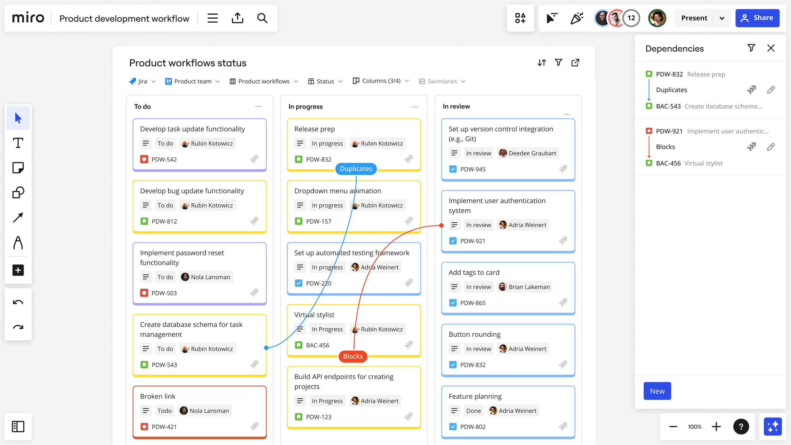
3. **Basecamp**
    

    Es una herramienta en línea para la gestión de proyectos que fomenta la colaboración y la eficiencia. Permite a los equipos crear proyectos y tareas, compartir archivos, mantener conversaciones y realizar un seguimiento del avance
    

    

#### 2.1 Análisis Competitivo
<table>
    <tr>
        <th colspan="6">Competitive Analysis Landscape</th>
    </tr>
    <tr style="text-align: justify">
        <td colspan="2">
            
¿Por qué llevan a cabo este análisis?

        </td>
        <td colspan="4">
            
El análisis lo llevamos a cabo para comparar nuestra idea de solución con otras existentes. De esta manera, podremos identificar nuestras fortalezas, debilidades, oportunidades y amenazas en relación con el mercado actual
            

        </td>
    </tr>
    <tr>
        <td colspan="2">Empresas:</td>
        <th>Workflow</th>
        <th>Trello</th>
        <th>Miro</th>
        <th>Basecamp</th>
    </tr>
    <tr style="text-align: justify">
        <th rowspan="2">Perfil</th>
        <th>Overview</th>
        <!-- Workflow -->
        <td>
                Plataforma de gestión de tareas y proyectos dirigida a los equipos de teletrabajo y estudiantes. Ofrece herramientas como calendario o barra de progreso para la eficiente organización
        </td>
        <!-- Trello -->
        <td>
                Herramienta de gestión de proyectos en línea que utiliza un enfoque visual para la organización de tareas y proyectos
        </td>
        <!-- Miro -->
        <td>
                Plataforma de colaboración en línea con pizarra digital donde los usuarios pueden crear, compartir y colaborar en tiempo real
        </td>
        <!-- Basecamp -->
        <td>
                Herramienta en línea que ayuda a los equipos a administrar y organizar sus tareas y proyectos, proporcionando un espacio para compartir información
        </td>
    </tr>
    <tr>
        <th> Ventaja Competitiva ¿Qué valor ofrece a los clientes? </th>
        <!-- Workflow -->
        <td> 
            Entorno de trabajo colaborativo con las herramientas necesarias para la organización 
        </td>
        <!-- Trello -->
        <td> 
            Tarjetas visuales que permiten visualizar y gestionar las actividades 
        </td>
        <!-- Miro -->
        <td> 
            Canvas intuitivo para generar presentaciones, ideas y diagramas 
        </td>
        <!-- Basecamp -->
        <td>
            Espacio de trabajo único y completo
        </td>
    </tr>
    <tr>
        <th rowspan="2">Perfil de Marketing</th>
        <th>Mercado Objetivo</th>
        <!-- Workflow -->
        <td>
            Equipos de teletrabajo y estudiantes con problemas de organización
        </td>
        <!-- Trello -->
        <td> 
            Equipos de gran tamaño que necesitan de una aplicación para la organización de sus proyectos y tareas
        </td>
        <!-- Miro -->
        <td> 
            Usuarios que necesitan de una plataforma para estructurar y plasmar su conocimiento
        </td>
        <!-- Basecamp -->
        <td> 
            Organizaciones y empresas que buscan soluciones para simplificar su trabajo remoto
        </td>
    </tr>
    <tr>
        <th>Estrategias de Marketing</th>
        <!-- Workflow -->
        <td>
            Marketing digital, primordialmente redes sociales
        </td>
        <!-- Trello -->
        <td> 
            Evaluación de habilidades y experiencia por parte de profesionales del mismo campo
        </td>
        <!-- Miro -->
        <td> 
            Redes sociales y pruebas con potenciales clientes
        </td>
        <!-- Basecamp -->
        <td> 
            Evaluación de habilidades y experiencia por parte de profesionales del mismo campo
        </td>
    </tr>
    <tr>
        <th rowspan="4">Perfil de Producto</th>
        <th>Productos y Servicios</th>
        <!-- Workflow -->
        <td>
            Herramientas de comunicación, colaboración y planificación que les permita a los usuarios tener un mejor flujo de trabajo y organización
        </td>
        <!-- Trello -->
        <td> 
            Gran variedad de planes y opciones que satisfacen las necesidades de los equipos de trabajo, especialmente los más grandes
        </td>
        <!-- Miro -->
        <td> 
            Herramientas populares, como plantillas personalizables y cambio de apariencia según las necesidades del usuario
        </td>
        <!-- Basecamp -->
        <td> 
            Diferentes planes que ofrecen almacenamiento de datos, más proyectos y diversas características extra, como chat en tiempo real
        </td>
    </tr>
    <tr>
        <th rowspan="2">Precios y Costos</th>
        <td colspan="4"> Plan gratuito con características básicas </td>
    </tr>
    <tr>
    <!-- Workflow -->
        <td>
            <ul>
                <li>
                    Plan de pago por $7 mensual con características, como chat IA y almacenamiento extra
                </li>
                <li>
                    Plan empresarial personalizado
                </li>
            </ul>
        </td>
        <!-- Trello -->
        <td> 
            Planes de pago que incluyen más funciones y almacenamiento.
        </td>
        <!-- Miro -->
        <td> 
            <ul>
                <li>
                    Planes de pago desde $8 mensuales que ofrecen funciones como aumentar el almacenamiento
                </li>
                <li>
                    Plan empresarial personalizado
                </li>
            </ul>
        </td>
        <!-- Basecamp -->
        <td> 
            <ul>
                <li>
                    Plan de negocios que ofrece más funciones y almacenamiento para equipos de hasta 100 usuarios
                </li>
                <li>
                    Plan empresarial personalizado
                </li>
            </ul>
        </td>
    </tr>
    <tr>
        <th>Canales de Distribución</th>
        <!-- Workflow -->
        <td>Móvil</td>
        <!-- El resto -->
        <td colspan="3"> Web y Móvil </td>
    </tr>
    <!-- Análisis FODA -->
    <tr>
        <th rowspan="4">Análisis FODA</th>
        <th>Fortalezas</th>
        <!--Workflow-->
        <td>
            La herramienta es sencilla de entender, incluso para estudiantes escolares sin experiencia previa. Es escalable para equipos de cualquier tamaño y proyecto.
        </td>
        <!-- Trello -->
        <td>
            La herramienta tiene una interfaz gráfica que es sencilla de navegar y utilizar. También, ofrece una amplia gama de funciones, como la comunicación en línea
        </td>
        <!-- Miro -->
        <td>
            La herramienta puede adaptarse a equipos de cualquier tamaño y, sin importar la complejidad de proyecto que se está desarrollando
        </td>
        <!-- Basecamp -->
        <td>
            La herramienta tiene una interfaz de usuario fácil de usar y navegar, al igual que una gran cantidad de funciones. Además, está disponible para dispositivos móviles y computadoras personales
        </td>
    </tr>
    <tr>
        <th>Debilidades</th>
        <!--Workflow-->
        <td>
            Para el buen funcionamiento de la aplicación, es necesario contar con dispositivos de media o alta gama
        </td>
        <!-- Trello -->
        <td>
            <ul>
                <li>
                    No cuenta con una función de seguimiento de tareas.
                </li>
                <li>
                    No es adecuada para proyectos complejos
                </li>
            </ul>
        </td>
        <!-- Miro -->
        <td>
            Algunas características tienen una curva alta de aprendizaje que pueden desmotivar al usuario en aprender su uso
        </td>
        <!-- Basecamp -->
        <td>
            No es adecuada para proyectos complejos, ya que carece de funciones importantes para proyectos de gran escala
        </td>
    </tr>
    <tr>
        <th>Oportunidades</th>
        <!--Workflow-->
        <td>
            Las nuevas tecnologías nos permiten desarrollar nuevas funcionalidades para la mejor experiencia de usuario
        </td>
        <!-- Trello -->
        <td>
            Las empresas deben implementar nuevos métodos y tecnologías a su software para mantenerse en el mercado
        </td>
        <!-- Miro -->
        <td>
            El desarrollo de nueva tecnología permite que se agreguen nuevas e innovadoras funcionalidades
        </td>
        <!-- Basecamp -->
        <td>
            Las nuevas herramientas nos permiten abrirnos a nuevos mercados
        </td>
    </tr>
    <tr>
        <th>Amenazas</th>
        <!--Workflow-->
        <td>
            Ser una incipiente empresa implica que los clientes desconocen de tu marca, lo que hace que sea más complicado vender tu solución de software
        </td>
        <!-- Trello -->
        <td>
            El desafío más grande de una empresa tecnológica independiente son los nuevos competidores y la falta de relación con Google
        </td>
        <!-- Miro -->
        <td>
            La industria tecnológica presenta siempre nuevos competidores, por lo que debemos estar siempre ofreciendo nuevas razones para atraer más clientes y retener a los actuales
        </td>
        <!-- Basecamp -->
        <td>
            Los desafíos más grandes son los nuevos competidores, la falta de recursos y la alta competitividad de la competencia
        </td>
    </tr>
</table>

#### 2.1.2 Estrategias y Tácticas frente a los competidores

    Nuestras estrategias incluyen la diferenciación mediante características únicas; cómo la competencia en costos; nuestro software será cómodo y accesible para nuestro segmento objetivo, la mejora de la estrategia de marketing; principalmente promocionarnos por las redes sociales, la innovación constante por medio de los comentarios, y la mejora del servicio al cliente.

### [2.2 Entrevistas](#entrevistas-need)

    Siguiendo la perspectiva de Easwaramoorthy y Zarinpoush (2006), las entrevistas representan una estrategia de investigación que implica el intercambio de diálogo con el propósito de adquirir datos, empleando cuestionamientos específicos para explorar en profundidad el pensamiento y la visión de la persona objeto de estudio.

#### 2.2.1. Diseño de entrevistas
- **Segmento: Equipos de Teletrabajo**
    Líderes de equipo de teletrabajo:
    1. Cuéntame un poco sobre ti, ¿Cuál es tu cargo laboral?
    2. En términos generales, ¿Cómo funciona su empresa?
    3. ¿Cuáles son tus metas?
    4. ¿Qué dispositivos tecnológicos, aplicaciones o marcas son los que más usas dentro de tu trabajo?
    5. ¿Cuáles son los problemas más importantes en su trabajo?
    6. Hemos notado que su empresa cuenta con la posibilidad de trabajar de manera remota, ¿Cómo funciona exactamente?
    7. ¿Utiliza actualmente un software para gestionar su(s) equipo(s) remoto(s)?
    8. ¿Tiene frecuentemente problemas de organización en sus equipos remotos, incluso con el software de gestión?
    9. ¿Puede, normalmente, solucionar este problema en los equipos?
    10. ¿Cree que una nueva herramienta que le permita organizar y gestionar sus equipos de teletrabajo sencillamente le sería de ayuda?
    
     

    Miembro de equipo de teletrabajo:
    1. Cuéntame un poco sobre ti, ¿Cuál es tu cargo laboral?
    2. En términos generales ¿De qué trata la empresa en la que trabaja?
    3. ¿Cómo funciona exactamente el trabajo remoto en su empresa?
    4. ¿Qué dispositivos tecnológicos son los que más usas dentro de tu trabajo?
    5. ¿Considera que la dificultad y experiencia laboral en el trabajo remoto es similar a la del presencial?
    6. ¿Tiene frecuentemente problemas de organización al trabajar remotamente?
    7. ¿Puede, normalmente, solucionar estos problemas?
    8. ¿Al trabajar remotamente es constantemente monitoreado su avance de trabajo?
    9. ¿Su empresa utiliza un sistema o programa para gestionar el avance de su trabajo? De ser así, ¿Cómo funciona?
    10. ¿Cree que una nueva herramienta que le permita organizar y gestionar su trabajo sencillamente le sería de ayuda?

- **Segmento Objetivo: Estudiantes**
    Estudiantes escolares y universitarios:
    1. Cuéntame un poco sobre ti, ¿En qué grado/ciclo académico estás?
    2. Académicamente hablando, ¿Te va bien en el colegio/universidad?
    3. ¿Tienes o intentas seguir normalmente un horario dedicado al estudio?
    4. ¿Cuentas con espacio acondicionado para estudiar?
    5. ¿Utilizas algún método de estudio?
    6. ¿Utilizas alguna herramienta para gestionar tus trabajos pendientes, como una agenda?
    7. ¿Qué tan frecuente te ocurre que te olvides de completar una tarea?
    8. ¿Te sientes o alguna vez te has sentido abrumado por la cantidad de trabajos y tareas que debes realizar? ¿Por qué?
    9. ¿Usted realiza actividades no relacionadas con el estudio, como practicar deporte o trabajar? De ser así, ¿Considera que estas actividades le quitan tiempo para realizar sus deberes académicos?
    10. ¿Crees que tu rendimiento académico mejoraría si contaras con una aplicación donde puedas gestionar tus tareas pendientes y organizar tus trabajos?

#### 2.2.2. Registro de entrevistas
Enlace del video de las entrevistas: **[Enlace del video](#)**
##### Entrevista 1:
    Nombre:
    Sexo:
    Residencia
    Inicio:
    Fin:
Descripción Básica de la entrevista
#### 2.2.3. Análisis de entrevistas
Las entrevistas realizadas revelaron los diferentes puntos de vista de las personas sobre el trabajo a distancia. Entre los principales problemas, podemos destacar:

- Asignación de tareas fuera del horario de trabajo

    
 
    La falta de una persona (o grupo de personas) que administre el trabajo realizado por los empleados permite que ocurran situaciones como esta. Algunos de los entrevistados suelen recibir llamadas, mensajes, correos o encargos fuera de su horario de trabajo, por lo que no están en obligación de responder o realizar el trabajo pedido. No obstante, en numerosas ocasiones, sí lo realizan. Las razones por las que lo hacen difieren entre persona y persona. Sin embargo, en general, la razón principal es que se sienten obligados a responder para quedar bien con su jefe.
    

- Aprovecharse de las limitaciones del programa de gestión
    

    Una gran cantidad de programas de gestión actuales cuentan con diversas formas en las que el usuario, sea trabajador, administrador o jefe de equipo, puede aprovecharse de sus funcionalidades. Uno de los problemas más frecuentes, mencionados por los entrevistados, es la facilidad con la que un trabajador puede utilizar el sistema para aparentar trabajar. Por ejemplo, un empleado puede establecer una cantidad de tiempo exagerada en la planilla para un trabajo bastante sencillo.
    

- Falta de comunicación con los clientes
    

    Las aplicaciones que utilizan las empresas para contactarse con los clientes no siempre son de lo más fiables. Existen ocasiones en las que, por ejemplo, los servidores están en mantenimiento o cuentan con algún error, lo que impide la comunicación entre el empleado y el cliente. Este tipo de situaciones son bastante perjudiciales, tanto para el cliente como para el empleado, ya que el primero no obtiene la información correctamente, por lo que puede perder el interés en la conversación y podría considerar la situación como algo recurrente, por lo que dudaría sobre la fiabilidad de la empresa; mientras que el segundo podría perder a un potencial cliente (o al cliente recurrente)
    

### [2.3 Needfinding](#needfinding)

    En las siguientes secciones se desarrolló todo el proceso del needfinding. El objetivo principal del needfinding es obtener una comprensión profunda y empática de los usuarios para informar el diseño de productos, servicios o experiencias que satisfagan sus necesidades de manera efectiva.

#### 2.3.1 User Personas
- **Segmento Objetivo: Equipo de Teletrabajo**
1. Líder de equipo de teletrabajo
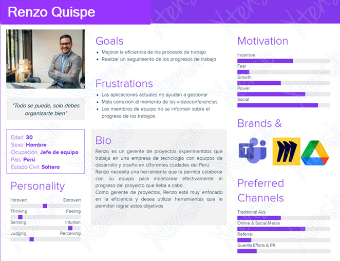

2. Miembro de equipo de teletrabajo
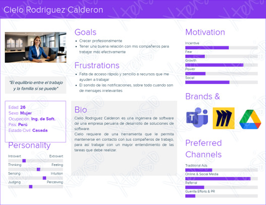

- **Segmento Objetivo: Estudiante**
1. Estudiante
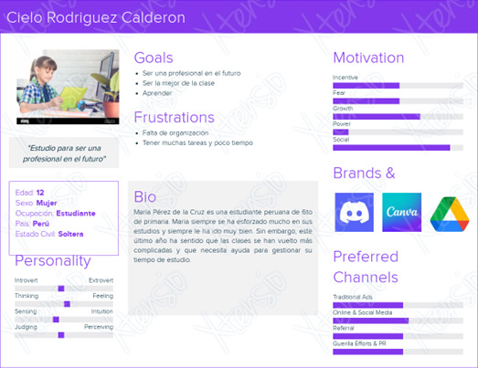

#### 2.3.2 User Task Matrix
Utilizaremos el user task matrix para organizar y priorizar las tareas que los usuarios deben poder realizar dentro de nuestro servicio.
<!--
    ---------Orden----------
    Renzo Quipe Palomino
    Cielo Rodriguez Calderon
    Maria Pérez de la Cruz
    ------------------------
-->
<table>
    <tr>
        <th rowspan="2">Task Matrix</th>
        <th colspan="2">Renzo Quispe Palomino</th>
        <th colspan="2">Cielo Rodriguez Calderon</th>
        <th colspan="2">Maria Pérez de la Cruz</th>
    </tr>
    <tr>
        <th>Frecuencia</th>
        <th>Importancia</th>
        <th>Frecuencia</th>
        <th>Importancia</th>
        <th>Frecuencia</th>
        <th>Importancia</th>
    </tr>
    <tr>
        <th>Crear Tareas</th>
        <td>Siempre</td>
        <td>Alta</td>
        <td>Siempre</td>
        <td>Alta</td>
        <td>Siempre</td>
        <td>Alta</td>
    </tr>
    <tr>
        <th>Establecer eventos o tareas en el calendario</th>
        <td>A veces</td>
        <td>Media</td>
        <td>Raramente</td>
        <td>Baja</td>
        <td>Siempre</td>
        <td>Muy Alta</td>
    </tr>
    <tr>
        <th>Establecer fechas límites de entregas de tareas</th>
        <td>Siempre</td>
        <td>Alta</td>
        <td>A veces</td>
        <td>Media</td>
        <td>Siempre</td>
        <td>Alta</td>
    </tr>
    <tr>
        <th>Hacer un seguimiento de una tarea o proyecto</th>
        <td>A veces</td>
        <td>Alta</td>
        <td>A veces</td>
        <td>Alta</td>
        <td>Siempre</td>
        <td>Alta</td>
    </tr>
    <tr>
        <th>Establecer la importancia de una tarea</th>
        <td>A veces</td>
        <td>Media</td>
        <td>A veces</td>
        <td>Media</td>
        <td>Siempre</td>
        <td>Alta</td>
    </tr>
    <tr>
        <th>Establecer la importancia de una tarea</th>
        <td>A veces</td>
        <td>Media</td>
        <td>A veces</td>
        <td>Media</td>
        <td>A veces</td>
        <td>Alta</td>
    </tr>
    <tr>
        <th>Marcar como cumplida las tareas</th>
        <td>A veces</td>
        <td>Media</td>
        <td>A veces</td>
        <td>Alta</td>
        <td>Siempre</td>
        <td>Muy Alta</td>
    </tr>
    <tr>
        <th>Aplazar la fecha límite de la tarea</th>
        <td>A veces</td>
        <td>Media</td>
        <td>Raramente</td>
        <td>Baja</td>
        <td>A veces</td>
        <td>Media</td>
    </tr>
    <tr>
        <th>Crear Proyecto</th>
        <td>A veces</td>
        <td>Muy Alta</td>
        <td>Nunca</td>
        <td>Ninguna</td>
        <td>Nunca</td>
        <td>Ninguna</td>
    </tr>
    <tr>
        <th>Editar Detalles de Proyecto</th>
        <td>A veces</td>
        <td>Alta</td>
        <td>Nunca</td>
        <td>Ninguna</td>
        <td>Nunca</td>
        <td>Ninguna</td>
    </tr>
    <tr>
        <th>Añadir miembros a un proyecto</th>
        <td>A veces</td>
        <td>Muy Alta</td>
        <td>Nunca</td>
        <td>Ninguna</td>
        <td>Nunca</td>
        <td>Ninguna</td>
    </tr>
    <tr>
        <th>Visualizar Integrantes de una tarea asignada al proyecto</th>
        <td>A veces</td>
        <td>Alta</td>
        <td>Nunca</td>
        <td>Ninguna</td>
        <td>Nunca</td>
        <td>Ninguna</td>
    </tr>
</table>

#### 2.3.3 User Journey Mapping

    La herramienta del journey mapping la utilizamos para visualizar y comprender la experiencia completa de un usuario al interactuar con nuestro servicio a lo largo del tiempo.

- **Segmento Objetivo: Equipo de Teletrabajo**
1. Líder de equipo de teletrabajo
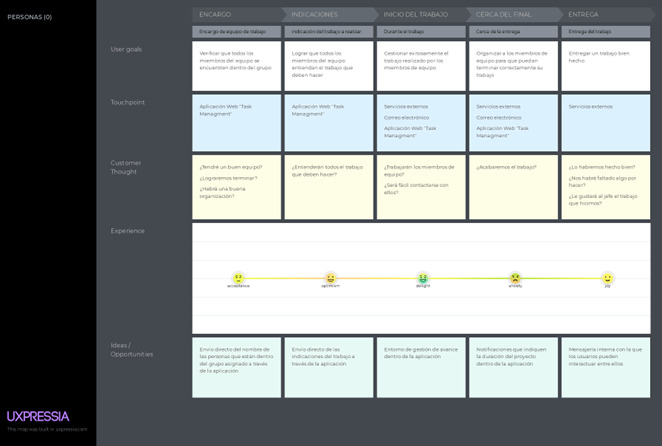

2. Miembro de equipo de teletrabajo
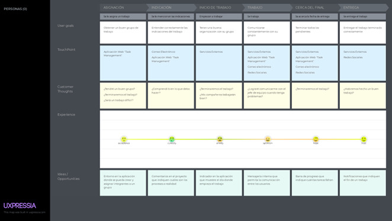

- **Segmento Objetivo: Estudiante**
1. Estudiante
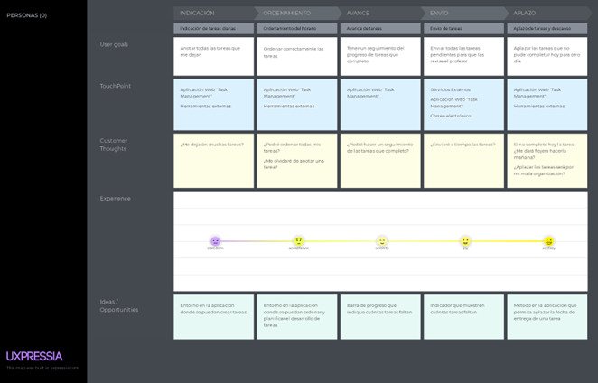

#### 2.3.4 Empathy Mapping

    El Empathy Mapping lo desarrollamos para profundizar en la comprensión de los usuarios para poder diseñar experiencias que se ajusten mejor a sus necesidades y deseos.

- **Segmento Objetivo: Equipo de Teletrabajo**
1. Líder de equipo de teletrabajo
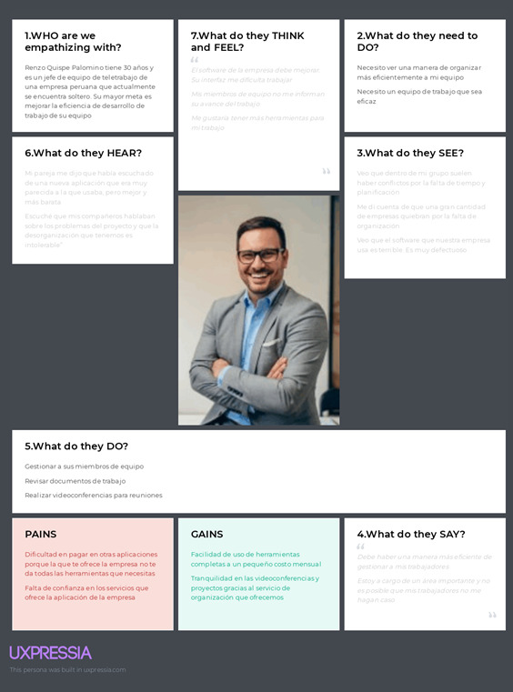

2. Miembro de equipo de teletrabajo
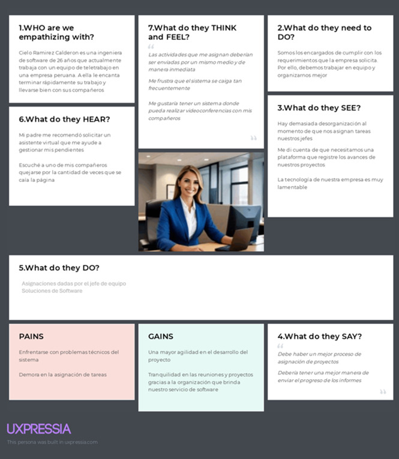

- **Segmento Objetivo: Estudiante**
1. Estudiante
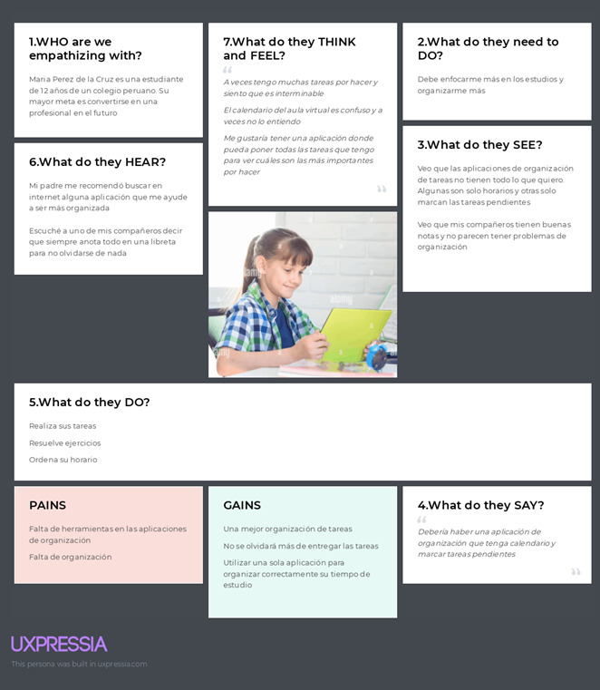

#### 2.3.5. As-is Scenario Mapping

    Los cuadros del As-Is Scenario Mapping los desarrollamos para verificar cómo es que es la situación actual con nuestros clientes y cómo podríamos mejorarla.

Enlace de cuadros realizados en Miro: **[Miro Board](https://miro.com/app/board/uXjVKWGn0ak=/?share_link_id=871702257753)**

- **Segmento Objetivo: Equipo de Teletrabajo**
1. Líder de equipo de teletrabajo
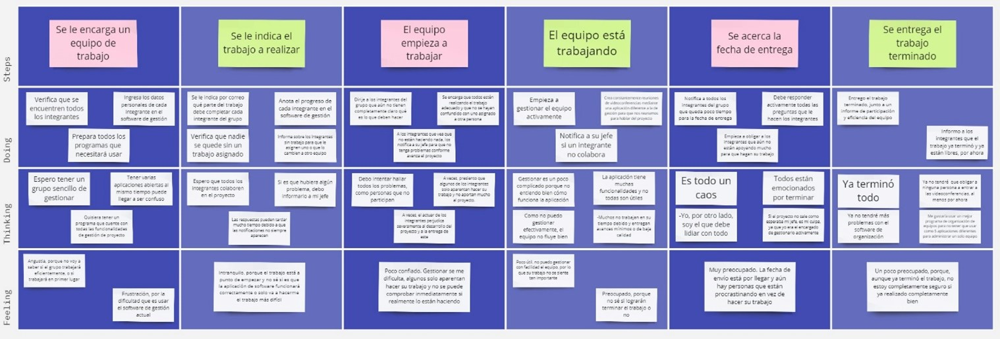

2. Miembro de equipo de teletrabajo
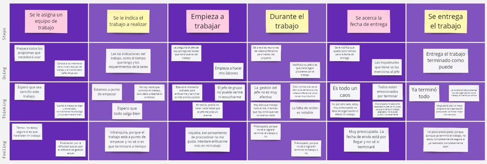

- **Segmento Objetivo: Estudiante**
1. Estudiante
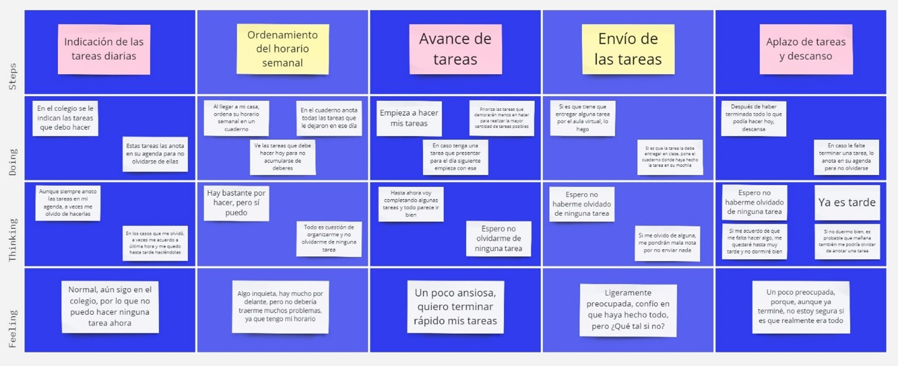

#### 2.3.6 Ubiquitous Language
GLOSARIO:

- **TEAM (Equipo):**
    > Grupo conformado por personas que trabajan en un mismo proyecto. Contiene solo un “Team Leader” y de uno a muchos “Team Member”

- **TEAM LEADER (Líder de equipo):**
    > Representante de un “Team”. Tiene como objetivo gestionar el trabajo realizado por los “Team Member”

- **TEAM MEMBER (Miembro de equipo):** 
    > Miembro de un “Team”. Tiene como objetivo completar los trabajos y las tareas indicadas por el “Team Leader”

- **PROJECT (Proyecto de trabajo):** 
    > Entorno de trabajo que el “Team Leader” y los “Team Member” utilizan para completar un proyecto propuesto. Los “Proyect” hacen uso de los objetos “Assigment”, “Progress Bar”, “Event”, “Calendar” y “Notification”

- **STUDENT (Estudiante):**
    > Persona que actualmente se encuentra estudiando en un colegio o universidad. Tiene como objetivo completar las tareas que se encuentran en el calendario.

- **ASSIGMENT (Tarea):**
    > Asignación asociada a un “Project” que el “Team Leader” le da a uno o más “Team Member”. Un “Assigment” debe ser completado en un intervalo de tiempo especificado por el “Team Leader”. Un “Assigment”

- **PROGESS BAR (Barra de progreso de tareas):** 
    > Indicador visual que muestra la cantidad de “Assigment” completadas y “Assigment” pendientes

- **EVENT (Evento):**
    > Un “Event” es un horario designado en el “Calendar” para realizar alguna actividad, sea relacionada con un “Proyect” o no. Por ejemplo, un “Event” puede ser “Reunión con los ‘Team Member’”.

- **CALENDAR (Calendario):**
    > Un “Calendar” es un calendario que incluye visualmente las fechas de entrega de los “Assigment” y las fechas donde ocurren los “Event”

- **NOTIFICATION (Notificación):**
    > Indicador visual que muestra un mensaje en el lado superior de la pantalla por un corto lapso.

- **DEADLINE (Fecha de entrega):**
    > Un “Deadline” indica cuándo un “Assigment” debe ser entregado.

#### 2.3.7 To-be Scenario Mapping
Los cuadros del To-Be Scenario Mapping los desarrollamos para indicar cómo es que la experiencia de los usuarios mejorará cuando utilicen nuestra aplicación móvil.

Enlace de cuadros realizados en Miro: **[Miro Board](https://miro.com/app/board/uXjVKWGn0ak=/?share_link_id=871702257753)**

- **Segmento Objetivo: Equipo de Teletrabajo**
1. Líder de equipo de teletrabajo

2. Miembro de equipo de teletrabajo
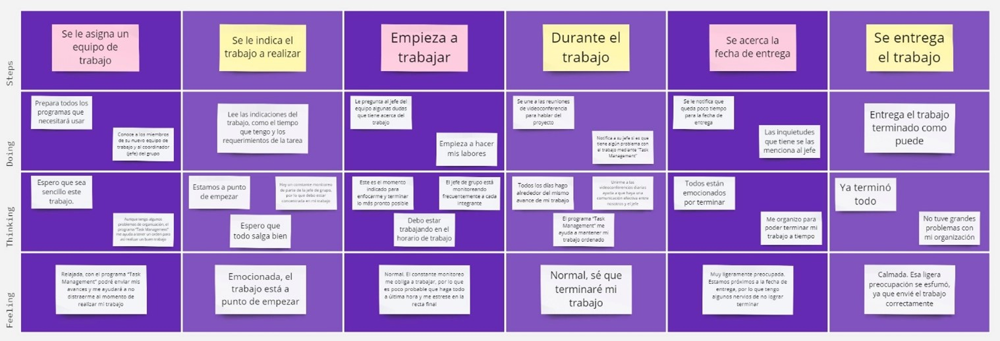

- **Segmento Objetivo: Estudiante**
1. Estudiante
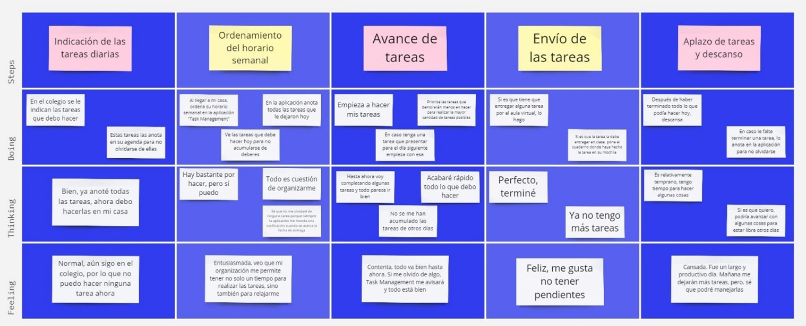

### [2.4 User Stories](#user-stories)
<table>
    <tr>
        <th>Story ID</th>
        <th>Título</th>
        <th>Descripción</th>
        <th>Criterios de Aceptación</th>
        <th>EPIC ID</th>
    </tr>
    <!--EPIC 1-->
    <tr>
        <td colspan="5">
            <h5 style="text-align: center">EPIC 1: LANDING PAGE</h5>
            

                Como visitante, quiero contar con una landing page para visualizar todas las funcionalidades que tiene la aplicación móvil que ofrece la empresa
            

        </td>
    </tr>
    <tr>
        <th>US01</th>
        <th>Implementación de Barra de navegación</th>
        <td>
            
 Como visitante 

            
 Quiero tener la opción de atravesar todas las secciones de la landing page a través de una barra de navegación 

            
 Para facilitar el acceso a la información 

        </td>
        <td>
            <h5>Escenario 1: Traslado de una sección a otra</h5>
                
 Dado que el usuario se encuentra en la landing page 

                
 Cuando el usuario seleccione una de las secciones de la barra de navegación 

                
 Entonces se trasladará a la sección seleccionada 

            <h5>Escenario 2: Selección de la misma sección de la landing page</h5>
                
 Dado que el usuario se encuentra en una sección específica de la landing page 

                
 Cuando el usuario seleccione la misma sección en la barra de navegación 

                
 Entonces la pantalla no se moverá a otra sección diferente 

        </td>
        <td>1</td>
    </tr>
    <tr>
        <th> US02 </th>
        <th> Logo y Descripción de la empresa </th>
        <td>
            
 Como visitante 

            
 Quiero visualizar el logo y descripción de la empresa 

            
 Para verificar que estoy en la landing page oficial de la empresa 

        </td>
        <td>
            <h5> Escenario 1: Visualización del Logo </h5>
                
 Dado que el usuario se encuentra en la landing page 

                
 Cuando el usuario seleccione “Inicio” en la barra de navegación 

                
 Entonces se trasladará al usuario a la sección del logo y descripción de la empresa 

            <h5>Escenario 2: El logo no aparece</h5>
                
 Dado que el usuario se encuentra en una sección específica de la landing page 

                
 Cuando el usuario seleccione “Inicio” en la barra de navegación 

                
 Y el logo de la empresa no haya cargado 

                
 Entonces se trasladará al usuario a la sección del logo y descripción de la empresa 

                
 Y aparecerá solo la descripción 

        </td>
        <td>1</td>
    </tr>
    <tr>
        <th>US03</th>
        <th>Detalles y Servicios de la empresa</th>
        <td>
            
 Como visitante 

            
 Quiero visualizar los detalles y servicios de la empresa 

            
 Para conocer de qué manera se puede utilizar la aplicación 

        </td>
        <td>
            <h5>Escenario 1: Traslado a la sección servicios</h5>
                
 Dado que el usuario se encuentra en la landing page 

                
 Cuando el usuario seleccione “Servicios” en la barra de navegación 

                
 Entonces se trasladará al usuario a la sección de detalles de servicios 

            <h5>Escenario 2: El usuario ya se encuentra en la sección servicios</h5>
                
 Dado que el usuario se encuentra en la sección “servicios” 

                
 Cuando el usuario seleccione “Servicios” en la barra de navegación 

                
 Entonces el sistema mantendrá al usuario en la sección seleccionada 

        </td>
        <td>1</td>
    </tr>
    <tr>
        <th>US04</th>
        <th>Clientes de la empresa</th>
        <td>
            
 Como visitante 

            
 Quiero visualizar las experiencias de clientes previos de la empresa 

            
 Para es que la vida de los usuarios cambió al utilizar la aplicación 

        </td>
        <td>
            <h5>Escenario 1: Traslado a la sección clientes</h5>
                
 Dado que el usuario se encuentra en la landing page 

                
 Cuando el usuario seleccione “Clientes” en la barra de navegación 

                
 Entonces se trasladará al usuario a la sección de experiencia de clientes 

            <h5>Escenario 2: El usuario ya se encuentra en la sección clientes</h5>
                
 Dado que el usuario se encuentra en la sección “clientes” 

                
 Cuando el usuario seleccione “Clientes” en la barra de navegación 

                
 Entonces el sistema mantendrá al usuario en la sección seleccionada 

        </td>
        <td>1</td>
    </tr>
    <tr>
        <th>US05</th>
        <th>Acerca de nosotros</th>
        <td>
            
 Como visitante 

            
 Quiero visualizar la misión y visión de la empresa 

            
 Para conocer qué planes tienen a futuro 

        </td>
        <td>
            <h5>Escenario 1: Traslado a la sección Nosotros</h5>
                
 Dado que el usuario se encuentra en la landing page 

                
 Cuando el usuario seleccione “Acerca de Nosotros” en la barra de navegación 

                
 Entonces se trasladará al usuario a la sección de experiencia de clientes 

            <h5>Escenario 2: El usuario ya se encuentra en la sección nosotros</h5>
                
 Dado que el usuario se encuentra en la sección “Nosotros” 

                
 Cuando el usuario seleccione “Acerca de Nosotros” en la barra de navegación 

                
 Entonces el sistema mantendrá al usuario en la sección seleccionada 

        </td>
        <td>1</td>
    </tr>
    <tr>
        <th>US06</th>
        <th>Implementación de un Footer</th>
        <td>
            
 Como visitante 

            
 Quiero visualizar un Footer al final de la página 

            
 Para ver las redes sociales asociadas a la empresa 

        </td>
        <td>
            <h5>Escenario 1: Traslado a la sección de footer</h5>
                
 Dado que el usuario se encuentra en la landing page 

                
 Cuando el usuario se dirija al final de la landing page 

                
 Entonces el usuario visualizará las redes sociales asociadas a la empresa 

            <h5>Escenario 2: Traslado al usuario de la red social seleccionada</h5>
                
 Dado que el usuario se encuentra en el footer 

                
 Cuando el usuario seleccione una de íconos de las redes sociales que aparecen la sección del footer 

                
 Entonces el sistema redirigirá al usuario a la red social indicada 

        </td>
        <td>1</td>
    </tr>
    <tr>
        <th>US07</th>
        <th>Translación a la aplicación móvil</th>
        <td>
            
 Como visitante 

            
 Quiero contar con un botón que me redirija a la aplicación móvil 

            
 Para tener un acceso directo y rápido a ella 

        </td>
        <td>
            <h5>Escenario 1: Traslado a la aplicación móvil</h5>
                
 Dado que el usuario se encuentra en la landing page 

                
 Cuando el dé click en el botón "Probar ahora" 

                
 Entonces el sistema redirigirá al usuario a la aplicación móvil 

            <h5>Escenario 2: Aplicación actualmente en mantenimiento</h5>
                
 Dado que el usuario se encuentra en la landing page 

                
 Cuando el dé click en el botón "Probar ahora" 

                
 Y lo servicios de la aplicación móvil estén actualmente en mantenimiento 

                
 Entonces aparecerá un mensaje, indicando que actualmente la aplicación móvil está en mantenimiento 

        </td>
        <td>1</td>
    </tr>
    <tr>
        <th>TS01</th>
        <th>Traslado a un entorno diferente</th>
        <td>
            
 Como desarrollador 

            
 Quiero que el usuario pueda trasladarse libremente entre todos los entornos de la landing page 

            
 Para que el usuario pueda ver todo lo que la aplicación ofrece 

        </td>
        <td>
            <h5>Escenario 1: Traslado exitoso</h5>
                
 Dado que el ENDPOINT/usuario está disponible 

                
 Cuando una solicitud GET sea enviada al presionar el botón "Probar ahora" 

                
 Entonces se recibe una respuesta con el estado 200 

                
 Y el mensaje “Traslado Exitoso” es mostrado 

                
 Y se redirige al usuario al entorno seleccionado 

            <h5>Escenario 2: Error del servidor</h5>
                
 Dado que el usuario se encuentra en la landing page 

                
 Cuando una solicitud GET sea enviada al presionar el botón "Probar ahora" 

                
 Y lo servicios de la aplicación móvil estén actualmente en mantenimiento 

                
 Entonces se recibe una respuesta con el estado 500 

                
 Y el mensaje “ERROR EN EL SERVIDOR” es mostrado 

        </td>
        <td>1</td>
    </tr>
    <!--EPIC 2-->
    <tr>
        <td colspan="5">
            <h5 style="text-align: center">EPIC 2: REGISTRO DE USUARIOS</h5>
            

                Como usuario, quiero poder registrarme e iniciar sesión para acceder a todas las herramientas que Task Management me ofrece
            

        </td>
    </tr>
    <tr>
        <th>US01</th>
        <th>Registro de usuario</th>
        <td>
            
 Como usuario de cualquiera de los segmentos objetivos sin una cuenta en el sistema 

            
 Quiero poder registrarme en la aplicación 

            
 Para acceder a todas sus funcionalidades 

        </td>
        <td>
            <h5>Escenario 1: Ingreso a la página "Crear una cuenta"</h5>
                
 Dado que el usuario se encuentra en la página "Inicio Sesión" 

                
 Cuando el usuario seleccione el botón "Crear nueva cuenta" 

                
 Entonces se redirige al usuario a la página "Crear nueva cuenta" 

            <h5>Escenario 2: Registro exitoso</h5>
                
 Dado que el usuario se encuentra en la página “Crear nueva cuenta” 

                
 Cuando el usuario ingrese todos sus datos de registro 

                
 Entonces el sistema crea una nueva cuenta, incluyendo los datos de registro proporcionados por el usuario 

                
 Y se redirige al usuario a la página principal 

            <h5>Escenario 3: Registro con datos incompletos</h5>
                
 Dado que el usuario se encuentra en la página “Crear nueva cuenta” 

                
 Cuando el usuario intente registrar una cuenta sin proporcionar todos los datos de registro requeridos 

                
 Entonces se muestra un mensaje de error, indicando que no puede crearse una cuenta sin haber completado todos los campos 

            <h5>Escenario 4: Registro con correo electrónico ya registrado</h5>
                
 Dado que el usuario se encuentra en la página “Crear nueva cuenta” 

                
 Cuando el usuario ingrese una dirección de correo electrónico ya está registrada en el sistema 

                
 Entonces se muestra un mensaje de error, indicando que la dirección de correo electrónico ya está en uso 

             <h5>Escenario 5: Registro con un nombre inválido</h5>
                
 Dado que el usuario se encuentra en la página “Crear nueva cuenta” 

                
 Cuando el usuario ingrese un nombre inválido 

                
 Entonces se muestra un mensaje de error, indicando que el nombre escrito no puede ser utilizado para crear una cuenta 

        </td>
        <td>2</td>
    </tr>
    <tr>
        <th>US02</th>
        <th>Acceso de usuario</th>
        <td>
            
 Como usuario de cualquiera de los segmentos objetivos sin una cuenta en el sistema 

            
 Quiero poder iniciar sesión en la aplicación utilizando mi dirección de correo electrónico y contraseña 

            
 Para acceder a mi cuenta y utilizar todas las funcionalidades de la aplicación 

        </td>
        <td>
            <h5>Escenario 1: Inicio de sesión exitoso</h5>
                
 Dado que el usuario se encuentra en la página "Inicio Sesión" 

                
 Cuando el usuario ingrese una dirección de correo electrónico que tenga una cuenta registrada en el sistema 

                
Y el usuario ingrese la contraseña asociada al correo electrónico proporcionado

                
 Entonces se redirige al usuario a la página principal de la aplicación 

            <h5>Escenario 2: Inicio de sesión con un correo electrónico no registrado en el sistema</h5>
                
 Dado que el usuario se encuentra en la página “Inicio Sesión” 

                
 Cuando el usuario ingrese una dirección de correo electrónico que no tenga una cuenta registrada en el sistema 

                
 Entonces se muestra un mensaje de error, indicando que el correo o contraseña es incorrecto 

            <h5>Escenario 3: Inicio de sesión con una contraseña inválida</h5>
                
 Dado que el usuario se encuentra en la página “Inicio Sesión” 

                
 Cuando el usuario ingrese una dirección de correo electrónico 

                
 Y una contraseña inválida

                
 Entonces se muestra un mensaje de 1error, indicando que el correo o contraseña es incorrecto 

            <h5>Escenario 4: Inicio de sesión con una cuenta desactivada</h5>
                
 Dado que el usuario se encuentra en la página de “Inicio Sesión” 

                
 Cuando el usuario intente iniciar sesión con una cuenta desactivada 

                
 Entonces el sistema activa automáticamente la cuenta

                
 Y se redirige al usuario a la página principal de la aplicación

        </td>
        <td>2</td>
    </tr>
    <tr>
        <th>TS01</th>
        <th>Registrar Usuario</th>
        <td>
            
 Como desarrollador 

            
 Quiero agregar usuarios a la base de datos 

            
 Para que puedan utilizar mi aplicación 

        </td>
        <td>
            <h5>Escenario 1: Registro de usuario exitoso</h5>
                
 Dado que el ENDPOINT/usuario está disponible 

                
 Cuando una solicitud POST sea enviada con los datos de nombre, edad, sexo, correo electrónico, contraseña 

                
 Entonces se recibe una respuesta con el status 201 

                
 Y un recurso de usuario es incluido en el campo de respuestas con un nuevo ID y los datos ofrecidos por el usuario 

            <h5>Escenario 2: Registro con correo electrónico ya registrado</h5>
                
 Dado que el ENDPOINT/usuario está disponible 

                
 Cuando una solicitud POST sea enviada con los datos de nombre, edad, sexo, correo electrónico, contraseña 

                
 Y la dirección de correo electrónico ingresada ya está registrada en el sistema 

                
 Entonces se recibe una respuesta con el status 400 

                
 Y un mensaje con el valor “Correo ya registrado” es mostrado 

            <h5>Escenario 3: Registro con datos incompletos</h5>
                
 Dado que el ENDPOINT/usuario está disponible 

                
 Cuando una solicitud POST sea enviada con solo algunos de los datos de nombre, edad, sexo, correo electrónico, contraseña 

                
 Entonces se recibe una respuesta con el status 400 

                
 Y un mensaje con el valor “Faltan datos” es mostrado 

            <h5>Escenario 4: Registro con un nombre de usuario prohibido</h5>
                
 Dado que el ENDPOINT/usuario está disponible 

                
 Cuando una solicitud POST sea enviada con los datos de nombre, edad, sexo, correo electrónico, contraseña 

                
 Y el dato nombre sea una palabra inválida 

                
 Entonces se recibe una respuesta con el status 400 

                
 Y un mensaje con el valor “Nombre Prohibido” es mostrado 

            <h5>Escenario 5: Registro con una edad inválida</h5>
                
 Dado que el ENDPOINT/usuario está disponible 

                
 Cuando una solicitud POST sea enviada con los datos de nombre, edad, sexo, correo electrónico, contraseña 

                
 Y el dato edad menor o igual a 0 o mayor que 130 

                
 Entonces se recibe una respuesta con el status 400 

                
 Y un mensaje con el valor “La edad no es número entero positivo menor a 130” es mostrado 

            <h5>Escenario 6: Registro con una contraseña débil</h5>
                
 Dado que el ENDPOINT/usuario está disponible 

                
 Cuando una solicitud POST sea enviada con los datos de nombre, edad, sexo, correo electrónico, contraseña 

                
 Y la contraseña sea muy débil (sin al menos una letra mayúscula, una letra minúscula, un número y un carácter especial) 

                
 Entonces se recibe una respuesta con el status 400 

                
 Y un mensaje con el valor de “La contraseña no incluye al menos una letra mayúscula, una letra minúscula, un número y un carácter especial” es mostrado 

        </td>
        <td>2</td>
    </tr>
    <tr>
        <th>TS02</th>
        <th>Acceder Usuarios</th>
        <td>
            
 Como desarrollador 

            
 Quiero poder permitir el acceso a los usuarios a la aplicación móvil 

            
 Para que puedan utilizar los servicios ofrecidos por nuestra empresa 

        </td>
        <td>
            <h5>Escenario 1: Inicio de sesión exitoso</h5>
                
 Dado que el ENDPOINT/usuario está disponible 

                
 Cuando una solicitud POST sea enviada con los datos de dirección de correo electrónico y contraseña que se encuentren guardados dentro de la base de datos

                
 Entonces se recibe una respuesta con el status 202 

                
 Y el sistema permite el acceso al usuario a la página principal 

            <h5>Escenario 2: Registro con correo electrónico ya registrado</h5>
                
 Dado que el ENDPOINT/usuario está disponible 

                
 Cuando una solicitud POST sea enviada con los datos de dirección de correo electrónico y contraseña 

                
 Y la dirección de correo electrónico no esté guardada en la base de datos 

                
 Entonces se recibe una respuesta con el status 404 

                
 Y un mensaje con el valor de “No existe una cuenta asociada a el correo electrónico proporcionado” es mostrado 

            <h5>Escenario 3: Inicio de sesión con contraseña incorrecta</h5>
                
 Dado que el ENDPOINT/usuario está disponible 

                
 Cuando una solicitud POST sea enviada con los datos de dirección de correo electrónico y contraseña 

                
 Y la contraseña sea incorrecta 

                
 Entonces se recibe una respuesta con el status 400 

                
 Y un mensaje con el valor “Datos incorrectos” es mostrado 

            <h5>Escenario 4: Inicio de sesión con datos incompletos</h5>
                
 Dado que el ENDPOINT/usuario está disponible 

                
 Cuando una solicitud POST sea enviada con solo uno de los datos de dirección de correo electrónico y contraseña 

                
 Entonces se recibe una respuesta con el status 400 

                
 Y un mensaje con el valor “Faltan Datos” es mostrado 

        </td>
        <td>2</td>
    </tr>
    <!--EPIC 3-->
    <tr>
        <td colspan="5">
            <h5 style="text-align: center">EPIC 3: RECUPERACIÓN DE CONTRASEÑA</h5>
            

                Como usuario, quiero poder recuperar mi contraseña para poder volver a ingresar a la aplicación si es que me olvido de ella
            

        </td>
    </tr>
    <tr>
        <th>US01</th>
        <th>Recuperación de Contraseña</th>
        <td>
            
 Como usuario de cualquiera de los segmentos objetivos 

            
 Quiero tener la capacidad de restablecer mi contraseña en caso de olvidarla 

            
 Para así poder acceder nuevamente a mi cuenta 

        </td>
        <td>
            <h5>Escenario 1: Ingreso al entorno “Recuperar Contraseña”</h5>
                
 Dado que el usuario se encuentra en la página “Inicio sesión” 

                
 Cuando el usuario dé clic en "Olvidé mi contraseña" 

                
 Entonces se redirige al usuario al entorno “Recuperar Contraseña” 

            <h5>Escenario 2: Recuperación con dirección de correo electrónico válido</h5>
                
 Dado que el usuario se encuentra en el entorno “Recuperar Contraseña” 

                
 Cuando el usuario escriba una dirección de correo electrónico registrada en el sistema 

                
 Entonces se muestra el entorno “Nueva Contraseña” 

            <h5>Escenario 3: Recuperación con dirección de correo electrónico inválido</h5>
                
 Dado que el usuario se encuentra en el entorno “Recuperar Contraseña” 

                
 Cuando el usuario proporcione una dirección de correo electrónico que no se encuentra actualmente registrada en el sistema 

                
 Entonces se muestra un mensaje de error, indicando que la dirección de correo electrónico no está registrada en el sistema 

            <h5>Escenario 4: Restablecimiento de contraseña exitoso</h5>
                
 Dado que el usuario se encuentra en la página “Nueva Contraseña” 

                
 Cuando el usuario ingresa una nueva contraseña 

                
 Entonces se muestra un mensaje de confirmación, indicando que la contraseña se ha restablecido correctamente 

                
 Y se redirige al usuario a la página “Inicio Sesión”

            <h5>Escenario 5: Restablecimiento de contraseña con la misma contraseña que la original</h5>
                
 Dado que el usuario se encuentra en la página “Recuperar Contraseña” 

                
 Cuando el usuario ingresa una contraseña igual a la que actualmente está utilizando 

                
 Entonces se muestra un mensaje de error, indicando que no puede cambiarse a la misma contraseña que está actualmente en uso 

        </td>
        <td>3</td>
    </tr>
    <tr>
        <th>TS01</th>
        <th>Recuperar Contraseña</th>
        <td>
            
 Como desarrollador 

            
 Quiero que el sistema permita a los usuarios recuperar su contraseña 

            
 Para permitir que los usuarios tengan un método para acceder de nuevo a la aplicación si es que se han olvidado de su contraseña 

        </td>
        <td>
            <h5>Escenario 1: Recuperación con dirección de correo electrónico válido</h5>
                
 Dado que el ENDPOINT/usuario está disponible 

                
 Cuando una solicitud POST sea enviada con el dato de dirección de correo electrónico 

                
 Y la dirección de correo electrónico ingresada esté registrada en el sistema 

                
 Entonces se recibe una respuesta con el status 202 

                
 Y el sistema permite el acceso al usuario al entorno “Nueva Contraseña” 

            <h5>Escenario 2: Recuperación con dirección de correo electrónico inválido</h5>
                
 Dado que el ENDPOINT/usuario está disponible 

                
 Cuando una solicitud POST sea enviada con el dato de dirección de correo electrónico 

                
 Y la dirección de correo electrónico ingresada no se encuentre registrada en el sistema 

                
 Entonces se recibe una respuesta con el status 401 

                
 Y un mensaje con el valor “El correo electrónico es incorrecto” es mostrado 

            <h5>Escenario 3: Restablecimiento de contraseña exitoso </h5>
                
 Dado que el ENDPOINT/usuario está disponible 

                
 Cuando una solicitud POST sea enviada con el dato de una nueva contraseña 

                
 Entonces se recibe una respuesta con el status 202

                
 Y el sistema redirige al usuario a la página principal 

            <h5>Escenario 4: Restablecimiento de contraseña con la misma contraseña que la original</h5>
                
 Dado que el ENDPOINT/usuario está disponible 

                
 Cuando una solicitud POST sea enviada con el dato de una contraseña

                
 Y la contraseña sea la misma que la contraseña actual 

                
 Entonces se recibe una respuesta con el status 406 

                
 Y un mensaje con el valor “La nueva contraseña coincide con la actual” es mostrado 

            <h5>Escenario 5: Restablecimiento de contraseña sin proporcionar una contraseña</h5>
                
 Dado que el ENDPOINT/usuario está disponible 

                
 Cuando una solicitud POST sea enviada sin datos

                
 Entonces se recibe una respuesta con el status 400 

                
 Y un mensaje con el valor “Contraseña no proporcionada” es mostrado 

        </td>
        <td>3</td>
    </tr>
    <!--EPIC 4-->
    <tr>
        <td colspan="5">
            <h5 style="text-align: center">EPIC 4: ELIMINACIÓN DE CUENTAS DE USUARIO</h5>
            

                Como usuario, quiero poder eliminar mi cuenta para dejar de utilizar la aplicación de manera definitiva
            

        </td>
    </tr>
    <tr>
        <th>US01</th>
        <th>Eliminación de cuenta</th>
        <td>
            
 Como usuario de cualquiera de los segmentos objetivos 

            
 Quiero poder eliminar mi cuenta 

            
 Para asegurarme que ningún tipo de información personal se quede en la aplicación cuando desee dejar de utilizarla 

        </td>
        <td>
            <h5>Escenario 1: Ingreso al entorno “Eliminar Cuenta”</h5>
                
 Dado que el usuario se encuentra en la página de “Configuración” 

                
 Cuando el usuario dé clic en “Eliminar Cuenta” 

                
 Entonces se redirige al usuario al entorno “Eliminar Cuenta” 

            <h5>Escenario 2: Eliminación de Cuenta</h5>
                
 Dado que el usuario se encuentra en el entorno “Eliminar Cuenta” 

                
 Cuando el usuario seleccione el botón “Eliminar Cuenta” 

                
 Entonces se muestra la ventana “Eliminación Definitiva de Cuenta”, indicando que la acción no podrá ser deshecha 

            <h5>Escenario 3: Confirmación de Eliminación de Cuenta</h5>
                
 Dado que el usuario se encuentra en la ventana “Eliminación Definitiva de Cuenta” 

                
 Cuando el usuario seleccione el botón “Eliminar Definitivamente” 

                
 Entonces se muestra un mensaje de confirmación, indicando que la cuenta ha sido eliminada 

                
 Y se redirige al usuario a la Página Principal 

        </td>
        <td>4</td>
    </tr>
    <tr>
        <th>TS01</th>
        <th>Eliminar Cuenta</th>
        <td>
            
 Como desarrollador 

            
 Quiero permitir al usuario eliminar su cuenta definitivamente mediante un solo entorno 

            
 Para que sea sencillo administrar la eliminación de las cuentas 

        </td>
        <td>
            <h5>Escenario 1: Eliminación de Cuenta</h5>
                
 Dado que el ENDPOINT/usuario está disponible 

                
 Cuando una solicitud DELETE sea enviada al presionar el botón “ELIMINAR DEFINITVAMENTE” 

                
 Entonces se recibe una respuesta con el status 200 

                
 Y el sistema redirige al usuario a la Página Principal 

            <h5>Escenario 2: Error al eliminar la cuenta</h5>
                
 Dado que el ENDPOINT/usuario está disponible 

                
 Cuando una solicitud DELETE sea enviada al presionar el botón “ELIMINAR DEFINITVAMENTE” 

                
 Y algún problema con el servidor ocurra 

                
 Entonces se recibe una respuesta con el status 400 

                
 Y un mensaje con el valor de "Error al eliminar la cuenta" aparece 

        </td>
        <td>4</td>
    </tr>
    <!--EPIC 5-->
    <tr>
        <td colspan="5">
            <h5 style="text-align: center">EPIC 5: CREACIÓN DE PROYECTOS</h5>
            

                Como jefe de equipo, quiero poder crear un proyecto bajo mi mando y para poder encargar a los miembros de equipo sus respectivos trabajos
            

        </td>
    </tr>
    <tr>
        <th>US01</th>
        <th>Creación de un Proyecto Nuevo</th>
        <td>
            
 Como usuario del segmento objetivo de equipos de teletrabajo 

            
 Quiero poder crear un nuevo proyecto en la aplicación 

            
 Para administrar y gestionar mis labores 

        </td>
        <td>
            <h5>Escenario 1: Acceder al entorno “Crear Proyecto”</h5>
                
 Dado que el jefe de equipo se encuentra en el entorno “Proyectos” 

                
 Cuando el jefe de equipo seleccione el botón “Crear Proyecto” 

                
 Entonces se le redirige al entorno “Crear Proyecto” 

            <h5>Escenario 2: Creación de proyecto exitosa</h5>
                
 Dado que el jefe de equipo se encuentra en el entorno “Crear Proyecto” 

                
 Cuando el jefe de equipo ingrese los detalles del proyecto 

                
Y seleccione el botón "Crear"

                
 Entonces se crea un nuevo proyecto con los detalles proporcionados 

                
 Y se muestra un mensaje de confirmación, indicando que el proyecto fue creado satisfactoriamente 

            <h5>Escenario 3: Creación de proyecto con datos incompletos</h5>
                
 Dado que el jefe de equipo se encuentra en el entorno “Crear Proyecto” 

                
 Cuando el jefe de equipo intenta crear un proyecto sin proporcionar todos los datos requeridos 

                
 Entonces se muestra un mensaje de error, indicando que todos los campos obligatorios deben ser completados 

            <h5>Escenario 4: Creación de proyecto con nombre duplicado</h5>
                
 Dado que el jefe de equipo se encuentra en el entorno “Crear Proyecto” 

                
 Cuando el jefe de equipo intenta crear un proyecto con un nombre que ya existe en la aplicación 

                
 Entonces se muestra un mensaje de error, indicando que ya existe un proyecto con ese nombre 

            <h5>Escenario 5: Creación de proyecto con nombre inválido</h5>
                
 Dado que el jefe de equipo se encuentra en el entorno “Crear Proyecto” 

                
 Cuando el jefe de equipo intente crear un nuevo proyecto con un nombre inválido 

                
 Entonces se muestra un mensaje de error, indicando que el nombre es inválido 

            <h5>Escenario 6: Creación de un proyecto con duración indefinida</h5>
                
 Dado que el jefe de equipo se encuentra en el entorno “Crear Proyecto” 

                
 Cuando el jefe de equipo intente crear un nuevo proyecto sin fecha de inicio ni fecha de límite 

                
 Entonces se creará un nuevo proyecto, indicando en la descripción que tiene “Duración Indefinida” 

        </td>
        <td>5</td>
    </tr>
    <tr>
        <th>US02</th>
        <th>Asignación de un Miembro a un Proyecto</th>
        <td>
            
 Como usuario del segmento objetivo de equipos de teletrabajo 

            
 Quiero poder asignar miembros a un proyecto 

            
 Para trabajar colaborativamente en el proyecto 

        </td>
        <td>
            <h5>Escenario 1: Ingreso al entorno “Detalles de Proyecto”</h5>
                
 Dado que el jefe de equipo se encuentra en el entorno “Proyectos” 

                
 Cuando el jefe de equipo presione un proyecto existe 

                
 Entonces se redirige al usuario al entorno “Detalles de Proyecto” 

            <h5>Escenario 2: Miembros disponibles para asignar a un proyecto</h5>
                
 Dado que el jefe de equipo se encuentra en el entorno “Detalles de Proyecto” 

                
 Cuando el jefe de equipo presiona el botón "Asignar miembros" 

                
Entonces se muestra la lista “Usuarios Disponibles”, indicando cada usuario que puede ser asignado al proyecto seleccionado

            <h5>Escenario 3: Asignación de miembros exitosa</h5>
                
 Dado que el jefe de equipo se encuentra en la lista “Usuarios Disponibles” 

                
 Cuando el jefe de equipo seleccione uno o más usuarios 

                
 Y dé clic en el botón “Agregar” 

                
 Entonces los miembros seleccionados se asignan al proyecto 

                
 Y se muestra un mensaje de confirmación, indicando que los usuarios fueron agregados al proyecto satisfactoriamente 

            <h5>Escenario 4: Asignación de miembro recientemente eliminado</h5>
                
 Dado que el jefe de equipo se encuentra en la lista “Usuarios Disponibles” 

                
 Cuando el jefe de equipo seleccione uno o más usuarios que hayan sido eliminados mientras se estaban agregando al proyecto 

                
 Y dé clic en el botón “Agregar” 

                
 Entonces aparecerá un mensaje de error, indicando que los miembros no están disponibles 

        </td>
        <td>5</td>
    </tr>
    <tr>
        <th>TS01</th>
        <th>Crear Proyecto</th>
        <td>
            
 Como desarrollador 

            
 Quiero permitir al jefe de equipo crear un proyecto 

            
 Para que pueda colaborar con sus amigos y compañeros 

        </td>
        <td>
            <h5>Escenario 1: Escenario 1: Crear Proyecto</h5>
                
 Dado que el ENDPOINT/usuario está disponible 

                
 Cuando una solicitud POST sea enviada con los detalles del proyecto (nombre, descripción, fecha de inicio, fecha de finalización) 

                
 Entonces se recibe una respuesta con el status 201 

                
 Y el mensaje “Proyecto Creado” es mostrado 

                
 Y el sistema crea un proyecto 

            <h5>Escenario 2: Crear proyecto con datos incompletos</h5>
                
 Dado que el ENDPOINT/usuario está disponible 

                
 Cuando una solicitud POST sea enviada con solo algunos de los datos requeridos 

                
 Entonces se recibe una respuesta con status 400 

                
 Y el mensaje “Datos incompletos” es mostrado 

            <h5>Escenario 3: Creación de proyecto con nombre duplicado</h5>
                
 Dado que el ENDPOINT/usuario está disponible 

                
 Cuando una solicitud POST sea enviada con todos los detalles del proyecto 

                
 Y ya existe un proyecto con el mismo nombre 

                
 Entonces se recibe una respuesta con status 400 

                
 Y el mensaje “NOMBRE DUPLICADO” es mostrado 

            <h5>Escenario 4: Creación de proyecto con nombre inválido</h5>
                
 Dado que el ENDPOINT/usuario está disponible 

                
 Cuando una solicitud POST sea enviada con todos los detalles del proyecto 

                
 Y el nombre es inválido 

                
 Entonces se recibe una respuesta con status 400 

                
 Y el mensaje “NOMBRE INVÁLIDO” es mostrado 

            <h5>Escenario 5: Creación de un proyecto con duración indefinida</h5>
                
 Dado que el ENDPOINT/usuario está disponible 

                
 Cuando una solicitud POST sea enviada con todos los detalles del proyecto excepto el de la duración 

                
 Entonces se recibe una respuesta con status 200 

                
 Y el mensaje “Proyecto Creado con duración indefinida” es mostrado 

                
 Y el sistema crea un proyecto con duración indefinida 

        </td>
        <td>5</td>
    </tr>
    <tr>
        <th>TS02</th>
        <th>Agregar miembros al proyecto</th>
        <td>
            
 Como desarrollador 

            
 Quiero permitir a los usuarios agregar a otros usuarios a un proyecto 

            
 Para que los usuarios puedan expandir su equipo de trabajo 

        </td>
        <td>
            <h5>Escenario 1: Visualizar Miembros disponibles</h5>
                
 Dado que el ENDPOINT/usuario está disponible 

                
 Cuando una solicitud GET sea enviada al presionar botón "Asignar miembros" 

                
 Entonces se recibe una respuesta con estatus 200 

                
 Y el mensaje “Usuarios disponibles” es mostrado 

                
 Y el sistema muestra a todos los usuarios disponibles para la asignación del proyecto 

            <h5>Escenario 2: Asignación de miembros exitosa</h5>
                
 Dado que el ENDPOINT/usuario está disponible 

                
 Cuando una solicitud POST sea enviada al presionar el botón “Agregar” 

                
 Entonces se recibe una respuesta con el status 202 

                
 Y el mensaje “Usuarios Agregados” es mostrado 

                
 Y el sistema asigna al proyecto a los miembros seleccionados 

            <h5>Escenario 3: Asignación de miembro recientemente eliminado </h5>
                
 Dado que el ENDPOINT/usuario está disponible 

                
 Cuando una solicitud POST sea enviada al presionar el botón “Agregar” 

                
 Y ya existe cualquiera de los usuarios que se estaban agregando fueron eliminados 

                
 Entonces se recibe una respuesta con status 400 

                
 Y el mensaje "Uno o más usuarios no está disponible" se muestra 

        </td>
        <td>5</td>
    </tr>
    <!--EPIC 6-->
    <tr>
        <td colspan="5">
            <h5 style="text-align: center">EPIC 6: CREACIÓN DE TAREAS LABORALES</h5>
            

                Como jefe de equipo, quiero poder crear tareas para que mis miembros de equipo conozcan qué trabajo deben realizar
            

        </td>
    </tr>
    <tr>
        <th>US01</th>
        <th>Creación de un Proyecto Nuevo</th>
        <td>
            
 Como usuario del segmento objetivo de equipos de teletrabajo 

            
 Quiero poder crear tareas 

            
 Para asignar a los miembros de equipo el trabajo que debe completar cada uno 

        </td>
        <td>
            <h5>Escenario 1: Entrada al entorno “Crear tarea”</h5>
                
 Dado que el jefe de equipo se encuentra en el entorno “Detalles de Proyecto” 

                
 Cuando el jefe de equipo dé clic en el botón "Crear tarea" 

                
 Entonces el sistema redirige al jefe de equipo al entorno “Crear Tarea” 

            <h5>Escenario 2: Creación de tarea exitosa</h5>
                
 Dado que el jefe de equipo se encuentra en el entorno “Crear Tarea” 

                
 Cuando el jefe de equipo llene todos los campos obligatorios de la tarea  

                
Y hace clic en el botón de "Crear tarea"

                
 Entonces se crea una nueva tarea con los detalles proporcionados 

                
 Y se muestra un mensaje de confirmación, indicando que la tarea fue creada satisfactoriamente 

            <h5>Escenario 3: Creación de tarea con datos incompletos</h5>
                
 Dado que el jefe de equipo se ubica en el entorno “Crear Tarea” 

                
 Cuando el jefe de equipo intente crear una tarea sin llenar todos los campos obligatorios 

                
 Entonces se muestra un mensaje de error, indicando que no puede crearse una tarea sin haber llenado todos los campos obligatorios 

            <h5>Escenario 4: Creación de tarea con nombre duplicado</h5>
                
 Dado que el jefe de equipo se encuentra en el entorno “Crear Tarea” 

                
 Cuando el jefe de equipo intente crear una tarea con un nombre que ya existe en el proyecto 

                
 Entonces se muestra un mensaje de error, indicando que ya existe una tarea con ese nombre 

            <h5>Escenario 5: Creación de tarea con un nombre inválido</h5>
                
 Dado que el jefe de equipo se encuentra en el entorno “Crear Tarea” 

                
 Cuando el jefe de equipo intente crear una tarea con un nombre inválido 

                
 Entonces se muestra un mensaje de error, indicando que no se puede crear una tarea con un nombre inválido 

        </td>
        <td>6</td>
    </tr>
    <tr>
        <th>US02</th>
        <th>Asignación de Responsabilidades a una Tarea</th>
        <td>
            
 Como usuario del segmento objetivo de equipos de teletrabajo 

            
 Quiero poder asignar responsables a las tareas 

            
 Para definir el encargado de completar cada tarea del proyecto

        </td>
        <td>
            <h5>Escenario 1: Entrada al entorno “Tareas”</h5>
                
 Dado que el jefe de equipo se encuentra en el entorno “Detalles de Proyecto” 

                
 Cuando el jefe de equipo seleccione el botón “Tareas” 

                
 Entonces se redirige al jefe de equipo al entorno “Tareas” 

            <h5>Escenario 2: Entrada al entorno “Detalles de tarea”</h5>
                
 Dado que el jefe de equipo está en el entorno “Tareas” 

                
 Cuando el jefe de equipo seleccione la opción de "Editar" 

                
Entonces se redirige al jefe de equipo al entorno “Detalles de tarea”

            <h5>Escenario 3: Asignación de Responsable</h5>
                
 Dado que el jefe de equipo se encuentra en el entorno “Detalles de tarea” 

                
 Cuando el jefe de equipo seleccione el botón “Responsable” 

                
 Entonces aparecerá la lista “Responsable”, indicando todos los usuarios disponibles 

            <h5>Escenario 4: Confirmación de Responsable</h5>
                
 Dado que el jefe de equipo se encuentra en la lista “Responsable” 

                
 Cuando el jefe de equipo elija un usuario como “Responsable” 

                
 Y de clic en “Confirmar” 

                
 Entonces se muestra un mensaje de confirmación, indicando que se ha asignado un responsable satisfactoriamente 

        </td>
        <td>6</td>
    </tr>
    <tr>
        <th>TS01</th>
        <th>Crear Tarea Laboral</th>
        <td>
            
 Como desarrollador 

            
 Quiero que los jefes de equipo puedan crear tareas 

            
 Para que los miembros de equipo puedan conocer qué parte del trabajo les toca 

        </td>
        <td>
            <h5>Escenario 1: Crear Tarea</h5>
                
 Dado que el ENDPOINT/usuario está disponible 

                
 Cuando una solicitud POST sea enviada con los detalles de la tarea (nombre, descripción, fecha límite) 

                
 Entonces se recibe una respuesta con el status 201 

                
 Y el mensaje “Tarea Creada” es mostrado 

                
 Y el sistema crea una tarea 

            <h5>Escenario 2: Crear tarea con datos incompletos</h5>
                
 Dado que el ENDPOINT/usuario está disponible 

                
 Cuando una solicitud POST sea enviada con solo algunos de los datos requeridos 

                
 Entonces se recibe una respuesta con status 400 

                
 Y el mensaje “Datos incompletos” es mostrado 

            <h5>Escenario 3: Creación de tarea con nombre duplicado</h5>
                
 Dado que el ENDPOINT/usuario está disponible 

                
 Cuando una solicitud POST sea enviada con todos los detalles de la tarea 

                
 Y ya existe una tarea con el mismo nombre 

                
 Entonces se recibe una respuesta con status 400 

                
 Y el mensaje “NOMBRE DUPLICADO” es mostrado 

            <h5>Escenario 4: Creación de tarea con nombre inválido</h5>
                
 Dado que el ENDPOINT/usuario está disponible 

                
 Cuando una solicitud POST sea enviada con todos los detalles de la tarea 

                
 Y el nombre es inválido 

                
 Entonces se recibe una respuesta con status 400 

                
 Y el mensaje “NOMBRE INVÁLIDO” es mostrado 

        </td>
        <td>6</td>
    </tr>
    <tr>
        <th>TS02</th>
        <th>Asignar Responsable a la tarea</th>
        <td>
            
 Como desarrollador 

            
 Quiero el usuario pueda asignar responsables a cada una de las tareas de un proyecto 

            
 Para que puedan los usuarios conozcan qué le toca a cada uno 

        </td>
        <td>
            <h5>Escenario 1: Visualizar Miembros disponibles</h5>
                
 Dado que el ENDPOINT/usuario está disponible 

                
 Cuando una solicitud GET sea enviada al presionar botón "Asignar miembros" 

                
 Entonces se recibe una respuesta con estatus 200 

                
 Y el mensaje “Usuarios disponibles” es mostrado 

                
 Y el sistema muestra a todos los usuarios disponibles para la asignación de la tarea

            <h5>Escenario 2: Asignación de miembros exitosa</h5>
                
 Dado que el ENDPOINT/usuario está disponible 

                
 Cuando una solicitud POST sea enviada al presionar el botón “Agregar” 

                
 Entonces se recibe una respuesta con el status 202 

                
 Y el mensaje “Usuarios Agregados” es mostrado 

                
 Y el sistema asigna a la tarea los miembros seleccionados 

            <h5>Escenario 3: Asignación de miembro recientemente eliminado </h5>
                
 Dado que el ENDPOINT/usuario está disponible 

                
 Cuando una solicitud POST sea enviada al presionar el botón “Agregar” 

                
 Y ya existe cualquiera de los usuarios que se estaban agregando fueron eliminados 

                
 Entonces se recibe una respuesta con status 400 

                
 Y el mensaje "Uno o más usuarios no está disponible" se muestra 

        </td>
        <td>6</td>
    </tr>
    <!--EPIC 7-->
    <tr>
        <td colspan="5">
            <h5 style="text-align: center">EPIC 6: GESTIÓN DE AVANCE DE PROYECTO</h5>
            

                Como jefe de equipo, quiero poder gestionar todos los proyectos a mi cargo y supervisar el trabajo de los miembros para conocer su progreso
            

        </td>
    </tr>
    <tr>
        <th>US01</th>
        <th>Actualización del estado de las tareas</th>
        <td>
            
 Como usuario del segmento objetivo de equipos de teletrabajo 

            
 Quiero actualizar el estado de las tareas 

            
 Para reflejar su progreso 

        </td>
        <td>
            <h5>Escenario 1: Actualización del estado de tarea exitosa</h5>
                
 Dado que el usuario se encuentra en el entorno “Detalles de tarea” 

                
 Cuando el usuario cambia el estado de la tarea de "En progreso" a "Completada" 

                
 Entonces muestra un mensaje, indicando el estado de la tarea se ha actualizado 

            <h5>Escenario 2: Actualización del estado de tarea sin permisos</h5>
                
 Dado que el usuario se encuentra en el entorno “Detalles de tarea” de una tarea asignada a otro usuario 

                
 Cuando el usuario intente cambiar el estado de la tarea  

                
 Entonces se muestra un mensaje, indicando que el usuario no tiene permisos para actualizar el proceso de la tarea 

        </td>
        <td>7</td>
    </tr>
    <tr>
        <th>US02</th>
        <th>Gestión de Avance del Proyecto</th>
        <td>
            
 Como usuario del segmento objetivo de equipos de teletrabajo 

            
 Quiero visualizar el avance del proyecto 

            
 Para verificar que se está desarrollando los proyectos del trabajo a una velocidad adecuada 

        </td>
        <td>
            <h5>Escenario 1: Visualización del progreso del proyecto</h5>
                
 Dado que el usuario se encuentra en el entorno “Detalles de Proyecto” 

                
 Cuando el usuario dé clic en el botón “Progreso” 

                
 Entonces se muestra el entorno “Progreso”, indicando las tareas pendientes y el porcentaje de avance general del proyecto 

            <h5>Escenario 2: Actualización del progreso del proyecto</h5>
                
 Dado que el usuario se encuentra en el entorno “Progreso” 

                
 Cuando el usuario realice cambios en el estado de las tareas del proyecto 

                
Entonces el sistema actualiza el entorno “Progreso”, mostrando los nuevos cambios realizados

            <h5>Escenario 3: Notificaciones de progreso del proyecto</h5>
                
 Dado que el usuario se encuentra inscrito en un proyecto 

                
 Cuando otro usuario realice algún avance importante en el progreso del proyecto 

                
 Entonces el usuario recibe una notificación, indicando que se han realizado un avance importante en el progreso del proyecto 

        </td>
        <td>7</td>
    </tr>
    <tr>
        <th>TS01</th>
        <th>Actualizar Estado de Tarea</th>
        <td>
            
 Como desarrollador 

            
 Quiero que los los miembros de equipo puedan actualizar el estado de desarrollo de una tarea 

            
 Para que puedan mostrarle el avance de sus partes al jefe de equipo 

        </td>
        <td>
            <h5>Escenario 1: Actualización de Tarea exitosa</h5>
                
 Dado que el ENDPOINT/usuario está disponible 

                
 Cuando una solicitud PUT sea enviada con los detalles de una tarea (nombre, descripción, fecha límite) 

                
 Entonces se recibe una respuesta con el status 201 

                
 Y el mensaje “Tarea Actualizada” es mostrado 

                
 Y el sistema actualiza la tarea seleccionada 

            <h5>Escenario 2: Actualización de Tarea sin permisos</h5>
                
 Dado que el ENDPOINT/usuario está disponible 

                
 Cuando una solicitud PUT sea enviada por un usuario sin permisos para la edición de una tarea 

                
 Entonces se recibe una respuesta con status 401 

                
 Y el mensaje “No tiene permisos para actualizar la tarea” es mostrado 

        </td>
        <td>7</td>
    </tr>
    <tr>
        <th>TS02</th>
        <th>Gestionar avance del proyecto</th>
        <td>
            
 Como desarrollador 

            
 Quiero que los usuarios del segmento objetivo de equipo de teletrabajo puedan visualizar y modificar el avance del proyecto 

            
 Para que puedan los usuarios conozcan cuánto se va avanzando del proyecto en cualquier momento 

        </td>
        <td>
            <h5>Escenario 1: Visualizar progreso del Proyecto</h5>
                
 Dado que el ENDPOINT/usuario está disponible 

                
 Cuando una solicitud GET sea enviada al presionar botón "Detalles de Proyecto" 

                
 Entonces se recibe una respuesta con estatus 200 

                
 Y el sistema muestra a todos las tareas pendientes 

                
 Y el sistema también muestra el porcentaje de avance general del proyecto

            <h5>Escenario 2: Actualizar el progreso del proyecto</h5>
                
 Dado que el ENDPOINT/usuario está disponible 

                
 Cuando una solicitud POST sea enviada al presionar al cambiar cualquiera de los elementos de un proyecto (marcar una tarea como completada, actualizar el porcentaje de avance) 

                
 Entonces se recibe una respuesta con el status 200 

                
 Y el sistema actualiza el entorno "Progreso", mostrando los nuevos cambios realizados 

            <h5>Escenario 3: Notificaciones de progreso del proyecto </h5>
                
 Dado que el ENDPOINT/usuario está disponible 

                
 Cuando una solicitud POST sea enviada al cambiar cualquiera de los elementos de un proyecto (marcar una tarea como completada, actualizar el porcentaje de avance) 

                
 Entonces se recibe una respuesta con status 200 

                
 Y el mensaje "Cambios realizado en el proyecto: {proyecto}" se muestra 

                
 Y el sistema envia una notificación al usuario, indicando que se han realizado un avance importante en el progreso del proyecto 

        </td>
        <td>6</td>
    </tr>
</table>

### [2.5. Impact Mapping](#impact-mapping)
### [2.6. Product Backlog](#product-backlog)
